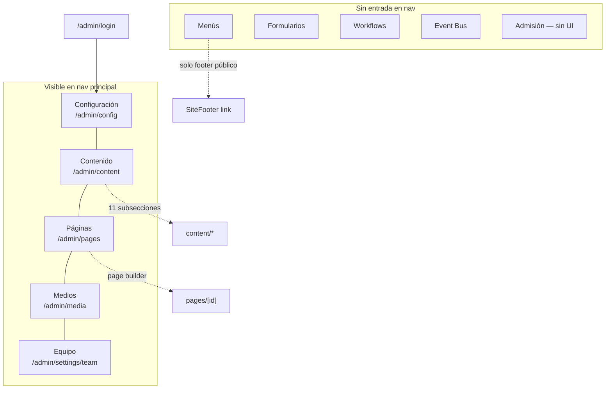
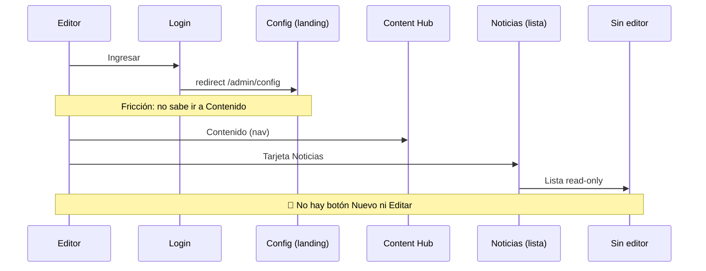
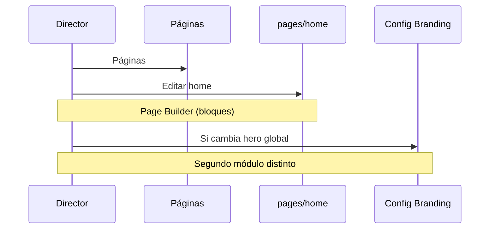
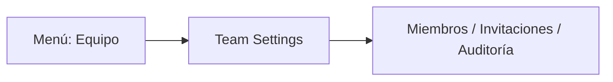
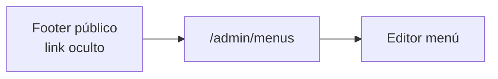
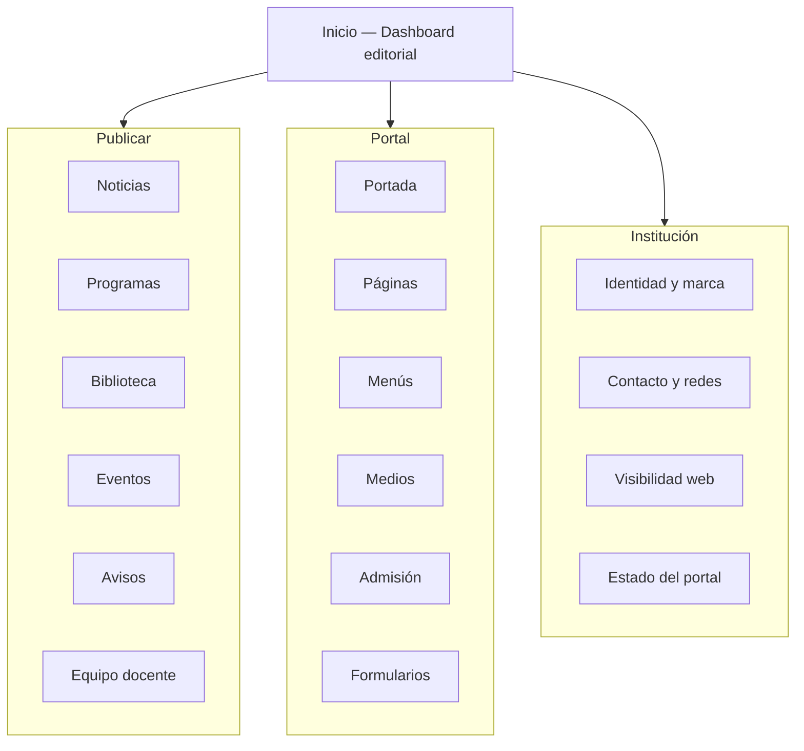

# CMS-NAVIGATION-AUDIT — Arquitectura de Navegación del Portal CMS

| Atributo | Valor |
| --- | --- |
| Código | OT-AUDIT-PORTAL-CMS-001 (Entregable 1) |
| Épica | EP-001A — Portal CMS |
| Prioridad | Muy Alta |
| Estado | Completada |
| Fecha | 2026-07-01 |
| Alcance | Rutas `/admin/*`, shell `AdminShell`, flujos entre módulos |
| Método | Recorrido 1 — Arquitectura (código + estructura de rutas) |
| Relacionado | [PORTAL-CMS-AUDIT.md](./PORTAL-CMS-AUDIT.md) |

> **Nota sobre capturas:** Esta auditoría documenta cada pantalla con la plantilla acordada. Las capturas visuales deben completarse en un recorrido manual con el CMS en ejecución (`npm run dev`) y almacenarse en `docs/audits/assets/cms-nav/` antes de la fase de diseño v2.

---

## 1. Resumen ejecutivo

El Portal CMS actual expone **5 ítems** en la barra principal (`AdminShell`) pero implementa **18 rutas** administrativas. Más de la mitad del producto es **invisible** para el usuario: menús, formularios de experiencia, workflows, event bus y admisión no tienen entrada en la navegación principal.

La pantalla de aterrizaje tras el login es **Configuración** (`/admin/config`), no un dashboard editorial. No existen breadcrumbs globales, accesos rápidos contextuales ni jerarquía que refleje el trabajo de un director o editor institucional.

**Veredicto:** la arquitectura de navegación responde a un **panel técnico de plataforma**, no a un **Centro de Administración Editorial**. Requiere rediseño completo de la IA (Information Architecture) antes de implementar Portal CMS v2.

| Dimensión | Estado | Prioridad |
| --- | --- | --- |
| Menú principal | 🟠 Incompleto y ambiguo | Alta |
| Jerarquía de módulos | 🔴 Plana y técnica | Crítica |
| Accesos rápidos | 🔴 Inexistentes | Crítica |
| Breadcrumbs | 🔴 Solo en Medios | Crítica |
| Flujo entre pantallas | 🟠 Inconsistente | Alta |
| Navegación móvil | 🔴 Ausente (< md) | Crítica |

---

## 2. Mapa actual de navegación

### 2.1 Barra principal (`AdminShell`)

Fuente: `src/components/identity/AdminShell.tsx`

| Orden | Etiqueta | Ruta | Activo en subrutas |
| ---: | --- | --- | --- |
| — | CMS SEM (logo) | `/admin/config` | — |
| 1 | Configuración | `/admin/config` | No (solo exact match parcial con `startsWith`) |
| 2 | Contenido | `/admin/content` | Sí |
| 3 | Páginas | `/admin/pages` | Sí |
| 4 | Medios | `/admin/media` | Sí |
| 5 | Equipo | `/admin/settings/team` | Sí |

**Menú de usuario** (dropdown): Mi perfil · Equipo y roles · Salir.

### 2.2 Rutas huérfanas (sin entrada en nav principal)

| Ruta | Título en UI | Cómo se llega hoy |
| --- | --- | --- |
| `/admin/menus` | Menús | Footer público (`SiteFooter`), URL directa |
| `/admin/menus/[id]` | Editor de menú | Desde listado de menús |
| `/admin/experience/forms` | Formularios de experiencia | URL directa |
| `/admin/experience/forms/[id]` | Editor de formulario | Desde listado |
| `/admin/workflows` | Workflow Engine | URL directa |
| `/admin/events` | Event Bus | URL directa |
| `/admin/settings/profile` | Mi perfil | Menú de usuario |
| `/admin/login` | Ingresar al CMS | Middleware / logout |
| `/admin/design-system` | — | Redirect → `/internal/design-system` |

### 2.3 Diagrama — estado actual



---

## 3. Hallazgos de arquitectura

### NAV-01 — No existe dashboard editorial 🔴 Crítico

Tras login, el usuario aterriza en **Configuration Hub** (`ConfigurationLayout` → «Configuration Hub»). Un director o editor espera ver estado del portal, tareas pendientes y accesos a publicar; en cambio ve formularios técnicos de institución, tenant y branding.

**Impacto:** el editor no sabe por dónde empezar. La configuración técnica compite con la operación editorial.

### NAV-02 — Colisión semántica «Equipo» 🔴 Crítico

El ítem **Equipo** del menú principal apunta a `/admin/settings/team` (usuarios CMS, roles, invitaciones). El contenido del equipo docente del portal vive en:

- `/admin/content/people` — Personas
- `/admin/content/team` — Equipo (legacy)
- Bloques `people` / `teachers` en `/admin/pages/home`

Un editor que busca «cambiar el equipo del portal» irá al ítem equivocado del menú.

### NAV-03 — Módulos críticos ocultos 🟠 Alto

| Módulo | Utilidad editorial | Visibilidad |
| --- | --- | --- |
| Menús | Editar navegación del sitio | Oculto (solo link en footer público) |
| Formularios | Contacto, postulación | Oculto |
| Admisión | Página `/admision` tiene API pero **sin pantalla admin** | Inexistente |
| Workflows / Event Bus | Operaciones de plataforma | Oculto (correcto para editores, incorrecto para admins) |

### NAV-04 — Jerarquía plana en Contenido 🟠 Alto

`/admin/content` muestra **11 colecciones** en grid plano sin agrupación:

Programas · Noticias · Personas · Equipo (legacy) · Biblioteca · Eventos · Agenda · Avisos · Testimonios · Galería · Categorías

No hay distinción entre **contenido editorial frecuente** (noticias, programas) y **infraestructura** (categorías, galería legacy). Tampoco entre colecciones con editor (`avisos`, `agenda`) y las de **solo lectura** (noticias, programas).

### NAV-05 — Sin breadcrumbs globales 🟠 Alto

Solo `MediaBreadcrumb` implementa migas de pan. El resto usa enlaces ad hoc (`← Contenido`, `Volver al CMS`). En Page Builder y Configuration Hub no hay contexto de ubicación.

### NAV-06 — Navegación móvil ausente 🔴 Crítico

```38:38:src/components/identity/AdminShell.tsx
            <nav className="hidden items-center gap-1 md:flex" aria-label="Administración">
```

Por debajo de `md` (768 px) el menú principal desaparece por completo. No hay drawer, hamburger ni menú inferior.

### NAV-07 — Patrones de «volver» inconsistentes 🟡 Medio

| Pantalla | Patrón de retorno |
| --- | --- |
| Team settings | «Volver al CMS» → `/admin/config` |
| Workflows / Events | Igual |
| Content section | `← Contenido` |
| Page editor | `← Páginas` |
| Menu editor | `← Menús` |
| Media | Botones a Contenido / Configuración |

No hay convención única ni breadcrumb estándar.

### NAV-08 — Home no es un destino de primer nivel 🟠 Alto

Editar la portada requiere: **Páginas** → buscar «home» → **Editar**. No hay acceso directo «Portada» ni atajo desde dashboard. Para un director, «cambiar el Home» no es evidente.

### NAV-09 — Separación Configuración vs Contenido confusa 🟡 Medio

Hero institucional se edita en **Configuración → Branding** (`HeroPortalPanel`). Bloques de home se editan en **Páginas → home**. Copy institucional en **Configuración → General** (`PortalCopyForm`). Un mismo objetivo editorial (portada) disperso en tres módulos.

### NAV-10 — Enlaces técnicos expuestos a editores 🟡 Medio

Content Hub muestra `POST /api/cms/content-query` y nombres de colección MongoDB (`academy_programs`) en tarjetas. Esto no pertenece a la navegación editorial.

---

## 4. Flujos entre pantallas

### 4.1 Flujo actual — publicar una noticia



**Pasos:** ≥ 4 · **Editor funcional:** No · **Tiempo estimado:** bloqueado

### 4.2 Flujo actual — cambiar el Home



**Pasos:** 3–5 según cambio · **Evidente:** No

### 4.3 Flujo actual — administrar usuarios del CMS



**Correcto para usuarios CMS**, pero el nombre choca con equipo docente del portal.

### 4.4 Flujo actual — editar menú de navegación pública



**Pasos desde CMS:** no hay ruta lógica · **Prioridad rediseño:** Alta

---

## 5. Propuesta — arquitectura de navegación v2

### 5.1 Principios

1. **Dashboard primero** — aterrizaje editorial, no configuración técnica.
2. **Lenguaje institucional** — sin jerga de plataforma en nav de primer nivel.
3. **Agrupación por intención** — Publicar · Portal · Institución · Sistema.
4. **Un nombre, un significado** — «Equipo del portal» ≠ «Usuarios del CMS».
5. **Breadcrumbs obligatorios** en toda ruta ≥ 2 niveles.
6. **Nav móvil** con drawer accesible por teclado.

### 5.2 Menú principal propuesto

| Ítem | Ruta propuesta | Audiencia | Reemplaza |
| --- | --- | --- | --- |
| **Inicio** | `/admin` | Todos | — (nuevo dashboard) |
| **Publicar** | `/admin/publish` | Editor, Comunicaciones | Hub editorial unificado |
| **Portal** | `/admin/portal` | Editor, Director | Páginas + Menús + Medios |
| **Institución** | `/admin/institution` | Director, Admin | Config (subset editorial) |
| **Usuarios** | `/admin/users` | Admin | settings/team |
| **Sistema** | `/admin/system` | Admin técnico | Workflows, Event Bus, flags avanzados |

**Subnavegación «Publicar» (ejemplo):**

- Noticias
- Programas formativos
- Biblioteca
- Eventos y agenda
- Avisos institucionales
- Equipo docente (personas)

**Subnavegación «Portal»:**

- Portada (home)
- Páginas
- Menús de navegación
- Biblioteca de medios
- Admisión (nuevo)
- Formularios

### 5.3 Diagrama — navegación propuesta



### 5.4 Breadcrumbs — convención propuesta

Formato: `Inicio › {Módulo} › {Sección} › {Registro}`

| Ruta | Breadcrumb |
| --- | --- |
| `/admin/content/news` | Inicio › Publicar › Noticias |
| `/admin/pages/home` | Inicio › Portal › Portada |
| `/admin/settings/team` | Inicio › Usuarios › Equipo del CMS |
| `/admin/media/folder/hero` | Inicio › Portal › Medios › Hero |

Componente sugerido: `AdminBreadcrumb` en `AdminShell`, alimentado por metadata de ruta o `layout.tsx` por segmento.

### 5.5 Accesos rápidos (dashboard)

| Acción | Destino | Rol |
| --- | --- | --- |
| Nueva noticia | `/admin/publish/news/new` | Editor |
| Editar portada | `/admin/portal/home` | Editor |
| Subir imagen | `/admin/portal/media?upload=1` | Editor |
| Estado del portal | `/admin/institution/status` | Director |
| Invitar usuario | `/admin/users/invitations` | Admin |

### 5.6 Navegación móvil

- Hamburger visible `< md` con los 5–6 ítems de primer nivel.
- Drawer con `focus trap`, `aria-modal`, cierre con Escape.
- Acciones frecuentes (Nueva noticia, Guardar) en barra inferior fija en editores.

---

## 6. Auditoría pantalla por pantalla (Recorrido 1)

Plantilla aplicada a cada ruta administrativa.

### 6.1 `/admin/login`

| Campo | Valor |
| --- | --- |
| **Captura** | `assets/cms-nav/01-login.png` (pendiente) |
| **Objetivo** | Autenticar al personal institucional |
| **Qué funciona** | Bootstrap del primer admin; mensaje de modo compatibilidad |
| **Qué confunde** | Subtítulo «Identity Core — AprendeHoy Learning OS»; referencia a tenant en bootstrap |
| **Eliminar** | Branding AprendeHoy en pantalla de login SEM |
| **Mover** | — |
| **Agregar** | Logo SEM, copy institucional, enlace ayuda |
| **Prioridad** | 🟠 Alto |
| **Clasificación** | Lenguaje / Identidad |

### 6.2 `/admin/config` — Configuration Hub

| Campo | Valor |
| --- | --- |
| **Captura** | `assets/cms-nav/02-config-hub.png` |
| **Objetivo** | Configurar institución, marca y estado del portal |
| **Qué funciona** | Sidebar con secciones; guardado centralizado; `PortalStatusCard` claro |
| **Qué confunde** | Título «Configuration Hub»; campo «Tenant» visible; mezcla hero en Branding |
| **Eliminar** | Eyebrow «CMS» genérico; metadatos `cms_config` para rol Editor |
| **Mover** | Estado del portal → dashboard; Experiencia/cursor → Sistema |
| **Agregar** | Renombrar a «Configuración institucional»; ocultar campos técnicos por rol |
| **Prioridad** | 🔴 Crítico |
| **Clasificación** | Arquitectura / Lenguaje |

### 6.3 `/admin/content` — Content Hub

| Campo | Valor |
| --- | --- |
| **Captura** | `assets/cms-nav/03-content-hub.png` |
| **Objetivo** | Acceder a colecciones de contenido editorial |
| **Qué funciona** | Grid de tarjetas; conteo de documentos; seed de contenido |
| **Qué confunde** | «Content Engine»; tarjeta «Motor POST /api/...»; nombres de colección MongoDB |
| **Eliminar** | Tarjetas técnicas; botón «Inicializar contenido» para producción |
| **Mover** | Reorganizar en grupos Publicar / Archivo |
| **Agregar** | Indicador de última edición; acceso directo a crear |
| **Prioridad** | 🔴 Crítico |
| **Clasificación** | Arquitectura / Lenguaje |

### 6.4 `/admin/content/*` — Listados de colección

| Campo | Valor |
| --- | --- |
| **Captura** | `assets/cms-nav/04-content-section.png` |
| **Objetivo** | Gestionar ítems de una colección |
| **Qué funciona** | Breadcrumb parcial `← Contenido`; lista con estado y slug |
| **Qué confunde** | Muestra `collection` técnico; sin editar en 9 de 11 secciones |
| **Eliminar** | Card con nombre de colección MongoDB |
| **Mover** | — |
| **Agregar** | CRUD completo; filtros; búsqueda; paginación |
| **Prioridad** | 🔴 Crítico |
| **Clasificación** | Flujo editorial |

### 6.5 `/admin/pages` — Constructor de Páginas

| Campo | Valor |
| --- | --- |
| **Captura** | `assets/cms-nav/05-pages-list.png` |
| **Objetivo** | Gestionar páginas del sitio |
| **Qué funciona** | Lista con estado; protección de home; vista previa publicada |
| **Qué confunde** | `prompt()` para crear página; «Inicializar CMS» técnico |
| **Eliminar** | Diálogos nativos del navegador |
| **Mover** | Home como «Portada» en nav Portal |
| **Agregar** | Modal de creación guiada; breadcrumb |
| **Prioridad** | 🟠 Alto |
| **Clasificación** | UX / Formularios |

### 6.6 `/admin/pages/[id]` — Page Builder

| Campo | Valor |
| --- | --- |
| **Captura** | `assets/cms-nav/06-page-builder.png` |
| **Objetivo** | Componer bloques de una página |
| **Qué funciona** | Paleta de bloques; preview por dispositivo; guardar/publicar |
| **Qué confunde** | Nombres de bloques en inglés (Feature Grid, People Grid); preview legacy |
| **Eliminar** | Bloques marcados legacy sin ocultar |
| **Mover** | — |
| **Agregar** | Glosario de bloques en español; breadcrumb |
| **Prioridad** | 🟠 Alto |
| **Clasificación** | Lenguaje / Consistencia |

### 6.7 `/admin/media` — Media Manager

| Campo | Valor |
| --- | --- |
| **Captura** | `assets/cms-nav/07-media.png` |
| **Objetivo** | Gestionar archivos multimedia |
| **Qué funciona** | `MediaBreadcrumb`; carpetas; integración con pickers |
| **Qué confunde** | Título «Media Manager»; «Tenant» en subtítulo |
| **Eliminar** | — |
| **Mover** | Bajo «Portal › Medios» |
| **Agregar** | Renombrar a «Biblioteca de medios» |
| **Prioridad** | 🟡 Medio |
| **Clasificación** | Lenguaje |

### 6.8 `/admin/menus` — Menús

| Campo | Valor |
| --- | --- |
| **Captura** | `assets/cms-nav/08-menus.png` |
| **Objetivo** | Editar navegación del sitio público |
| **Qué funciona** | CRUD completo; seed de menús default |
| **Qué confunde** | Campo «ID» y «Ubicación» técnica; sin entrada en nav |
| **Eliminar** | — |
| **Mover** | Portal › Menús de navegación |
| **Agregar** | Entrada en menú principal; ayuda contextual |
| **Prioridad** | 🟠 Alto |
| **Clasificación** | Arquitectura |

### 6.9 `/admin/settings/team` — Equipo e identidad

| Campo | Valor |
| --- | --- |
| **Captura** | `assets/cms-nav/09-team-cms.png` |
| **Objetivo** | Gestionar usuarios del CMS |
| **Qué funciona** | Invitaciones, roles, auditoría básica |
| **Qué confunde** | Nombre «Equipo» en nav principal; roles en inglés; aviso `IDENTITY_ENFORCE` |
| **Eliminar** | Código técnico en banner de compatibilidad (para editores) |
| **Mover** | Renombrar nav a «Usuarios» |
| **Agregar** | Glosario de roles Portal vs AprendeHoy |
| **Prioridad** | 🔴 Crítico |
| **Clasificación** | Arquitectura / Usuarios |

### 6.10 Rutas técnicas ocultas

| Ruta | Prioridad ocultar de editores | Notas |
| --- | --- | --- |
| `/admin/workflows` | 🟢 Correcto ocultar | Mover a Sistema |
| `/admin/events` | 🟢 Correcto ocultar | Mover a Sistema |
| `/admin/experience/forms` | 🟠 Debe ser visible | Bajo Portal › Formularios |
| Admisión (sin UI) | 🔴 Crítico | Crear pantalla admin |

---

## 7. Matriz de prioridades — navegación

| ID | Hallazgo | Severidad | Esfuerzo v2 |
| --- | --- | --- | --- |
| NAV-01 | Dashboard como landing | 🔴 | M |
| NAV-02 | Renombrar Equipo → Usuarios | 🔴 | S |
| NAV-06 | Nav móvil | 🔴 | M |
| NAV-08 | Atajo Portada | 🟠 | S |
| NAV-03 | Exponer Menús y Formularios | 🟠 | S |
| NAV-04 | Agrupar Content Hub | 🟠 | M |
| NAV-05 | Breadcrumbs globales | 🟠 | M |
| NAV-09 | Unificar edición de Home | 🟡 | L |
| NAV-07 | Estandarizar «volver» | 🟡 | S |

---

## 8. Criterios de aceptación — navegación v2

- [ ] Login redirige a `/admin` (dashboard), no a configuración.
- [ ] 100 % de rutas editoriales alcanzables en ≤ 2 clics desde dashboard.
- [ ] Cero colisiones de nombres entre contenido del portal y usuarios CMS.
- [ ] Breadcrumbs en todas las rutas con profundidad ≥ 2.
- [ ] Menú principal usable en viewport 375 px sin pérdida de módulos.
- [ ] Menús, Formularios y Admisión tienen entrada explícita en IA v2.
- [ ] Rutas de plataforma (workflows, event bus) solo bajo «Sistema».

---

*Documento generado en el marco de OT-AUDIT-PORTAL-CMS-001. Sin cambios de código.*
