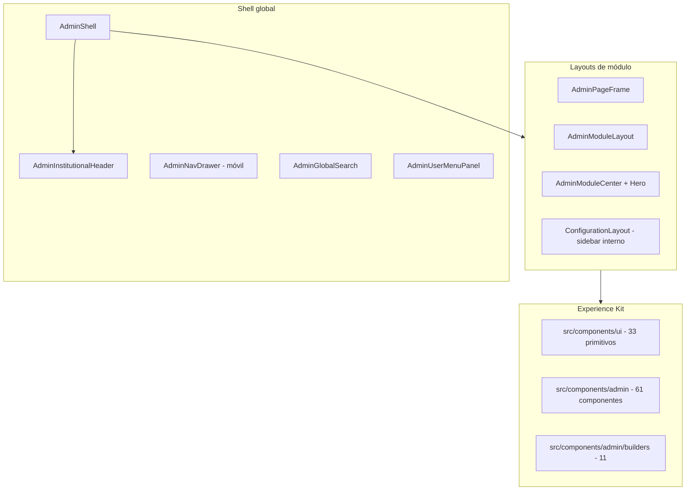
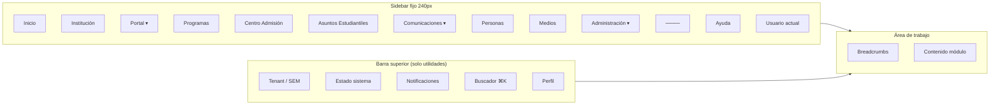
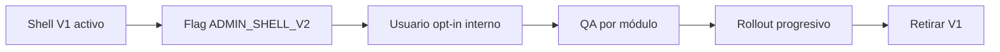

# OT-UX-AUDITORIA-001 — Auditoría Integral UX/UI del Centro SEM

| Atributo | Valor |
| --- | --- |
| Código | OT-UX-AUDITORIA-001 |
| Prioridad | Muy Alta |
| Tipo | Auditoría UX/UI + Planificación (sin implementación) |
| Estado | **Completada — pendiente aprobación** |
| Fecha | 2026-07-03 |
| Alcance | Centro de Administración `/admin/*` (31 rutas, 11 módulos nav) |
| Restricción | **Cero cambios funcionales** — solo análisis, diseño y planificación |
| Relacionado | [CMS-NAVIGATION-AUDIT](./CMS-NAVIGATION-AUDIT.md) · [CMS-UX-GUIDELINES](../design/CMS-UX-GUIDELINES.md) · [UX-AUDIT-001](./UX-AUDIT-001.md) (portal público) |

> **Capturas:** Las plantillas de captura por módulo están definidas en §3. Completar en recorrido manual (`npm run dev` → login Keycloak) y guardar en `docs/audits/assets/ot-ux-auditoria-001/{modulo}/`. Esta OT documenta el análisis basado en código fuente + recorrido estructural; las capturas son complemento visual obligatorio antes de aprobar la fase de implementación.

---

## Resumen ejecutivo

El **Centro SEM** ha evolucionado de un panel técnico a un centro editorial institucional parcialmente maduro: existe un Experience Kit (`src/components/ui`), guías CMS (`CMS-UX-GUIDELINES.md`), shell compartido (`AdminShell` + `AdminInstitutionalHeader` + `AdminModuleLayout`) y 11 ítems de navegación principal. Sin embargo, la experiencia **no se percibe como una plataforma SaaS moderna**: la navegación funcional vive en una barra horizontal superior saturada, hay **triple capa de títulos** en varias pantallas, **componentes duplicados** (cards, badges, tablas, heroes CSS), rutas legacy coexistiendo con rutas nuevas, y **4 implementaciones de tabla** sin primitivo compartido.

**Veredicto:** Aprobable iniciar rediseño visual **solo tras validar este informe**. La implementación debe ser **gradual por fases** (shell → módulos críticos → módulos secundarios), nunca un big-bang.

| Dimensión | Estado | Prioridad rediseño |
| --- | --- | --- |
| Arquitectura de navegación | 🟠 Horizontal + drawer móvil; sin sidebar fijo desktop | Crítica |
| Consistencia visual | 🟠 Kit definido; práctica diverge en admin | Alta |
| Jerarquía tipográfica | 🟠 Doble/triple hero en dashboard y hubs | Alta |
| Componentes duplicados | 🔴 Cards, badges, tablas, heroes CSS | Crítica |
| Responsive admin | 🟡 Drawer < lg; nav horizontal ≥ lg | Media |
| Productividad / clics | 🟠 Profundidad 2–4 en contenido y formularios | Alta |
| Accesibilidad admin | 🟡 Parcial (sin focus trap drawer auditado) | Media |
| Documentación visual admin | 🔴 Showcase solo portal; admin sin catálogo | Alta |

**Leyenda:** 🟢 Conforme · 🟡 Mejorable · 🔴 Crítico

---

## 1. Mapa completo del sistema

### 1.1 Arquitectura de capas



### 1.2 Inventario de rutas `/admin/*` (31 pantallas)

| Ruta | Módulo nav | Profundidad | Componente principal |
| --- | --- | ---: | --- |
| `/admin` | Inicio | 1 | `AdminDashboardClient` |
| `/admin/login` | — | — | Login (sin chrome) |
| `/admin/config` | Institución | 2 | `ConfigurationHub` (8 secciones sidebar) |
| `/admin/pages` | Portal | 2 | Listado páginas CMS |
| `/admin/pages/[id]` | Portal | 3 | Page builder / editor |
| `/admin/menus` | Portal | 3 | Listado menús |
| `/admin/menus/[id]` | Portal | 4 | Editor menú |
| `/admin/experience-studio` | Portal | 3 | Visual builder canvas |
| `/admin/portal/forms` | Portal | 3 | `FormsCenterClient` |
| `/admin/portal/forms/[id]` | Portal | 4 | `FormDetailClient` |
| `/admin/portal/forms/convocatorias/[slug]` | Portal / AE | 5 | `ConvocatoriaAdminPanel` |
| `/admin/experience/forms` | Portal (legacy) | 3 | Redirect / duplicado |
| `/admin/experience/forms/[id]` | Portal (legacy) | 4 | Legacy |
| `/admin/content` | Comunicaciones | 2 | Hub editorial |
| `/admin/content/[section]` | Comunicaciones | 3 | Listados por colección |
| `/admin/content/[section]/edit/[id]` | Comunicaciones | 4 | `ContentEditorClient` / `PersonEditorClient` |
| `/admin/content/programs` | Programas | 2 | Listado programas |
| `/admin/content/people` | Personas | 2 | `PeopleListClient` |
| `/admin/portal/admission` | Centro de Admisión | 2 | `AdmissionCmsClient` |
| `/admin/portal/asuntos-estudiantiles` | Asuntos Estudiantiles | 2 | `StudentAffairsHomeClient` |
| `/admin/portal/asuntos-estudiantiles/equipo` | Asuntos Estudiantiles | 3 | `StudentAffairsTeamClient` |
| `/admin/portal/asuntos-estudiantiles/[formId]` | Asuntos Estudiantiles | 3 | `StudentAffairsOperationsPanel` |
| `/admin/media` | Medios | 2 | `MediaManager` |
| `/admin/settings/users` | Administración | 2 | `UsuariosCmsClient` |
| `/admin/settings/team` | Administración | 2 | Redirect → users |
| `/admin/settings/integrations` | Administración | 3 | `StorageIntegrationsClient` |
| `/admin/settings/profile` | Perfil | 3 | `ProfileProfessionalClient` |
| `/admin/settings/security` | Perfil | 3 | `SecuritySettingsClient` |
| `/admin/settings/activity` | Perfil | 3 | `ActivityClient` |
| `/admin/settings/notifications` | Perfil | 3 | Placeholder fase 2 |
| `/admin/settings/help` | Ayuda | 2 | Enlaces guía |
| `/admin/workflows` | Administración | 3 | `AdminSystemPanel` |
| `/admin/events` | Administración | 3 | Event bus panel |
| `/admin/design-system` | — | — | Redirect → `/internal/design-system` |

### 1.3 Colecciones de contenido (Comunicaciones + Personas)

| Sección | Colección MongoDB | Editor |
| --- | --- | --- |
| Programas | `academy_programs` | content |
| Noticias | `content_news` | content |
| Personas | `content_people` | person |
| Biblioteca | `content_library` | content |
| Eventos | `content_events` | content |
| Agenda académica | `content_academic_agenda` | content |
| Avisos | `content_institutional_notices` | content |
| Testimonios | `academy_testimonials` | content |
| Galería | `academy_gallery` | content |
| Categorías | `academy_categories` | category |
| Equipo (legacy) | `academy_team` | content |

### 1.4 Rutas huérfanas y legacy

| Problema | Rutas | Impacto UX |
| --- | --- | --- |
| Duplicidad formularios | `/admin/portal/forms` vs `/admin/experience/forms` | Confusión, bookmarks rotos |
| Hub programas no cableado | `ProgramsHubClient` sin `page.tsx` | Código muerto + CSS huérfano (`admin-programs-hub.css`) |
| Design system fuera de admin | `/internal/design-system` | Descubrimiento bajo para editores |
| Workflows / Events | Sin ítem nav dedicado claro | Solo vía Administración o URL directa |

---

## 2. Auditoría por módulo

Plantilla aplicada a cada ítem del menú propuesto.

---

### 2.1 🏠 Inicio (`/admin`)

**Estado actual:** Dashboard institucional con stats, bienvenida, accesos rápidos y preview de auditoría.

| Aspecto | Detalle |
| --- | --- |
| **Componentes** | `AdminPageFrame`, `AdminDashboardClient`, `AdminModuleHero`, `AdminModuleStats`, `AdminQuickActions`, `AuditTimeline` |
| **Profundidad** | 1 clic desde login |
| **Fortalezas** | Datos reales (noticias, programas, invitaciones, miembros); preview actividad reciente |
| **Debilidades** | **Doble hero**: `AdminPageFrame` (H1 "Centro de administración") + `AdminModuleHero` interno; stats con cards inline no alineadas al Kit |
| **Problemas UX** | No hay widgets configurables; accesos rápidos estáticos; no distingue rol (Director vs Asuntos estudiantiles) |
| **Capturas requeridas** | `inicio/desktop.png`, `inicio/mobile.png` |

**Wireframe propuesto (desktop):**

```
┌──────────┬────────────────────────────────────────────────────┐
│ SIDEBAR  │ [Tenant] [Estado] [🔔] [🔍] [Perfil ▾]            │
│          ├────────────────────────────────────────────────────┤
│ ● Inicio │ Buenos días, Marco · Director General              │
│          │ ┌────────┐ ┌────────┐ ┌────────┐ ┌────────┐       │
│          │ │Noticias│ │Program.│ │Equipo  │ │Forms   │       │
│          │ └────────┘ └────────┘ └────────┘ └────────┘       │
│          │ Accesos rápidos (contextuales por rol)             │
│          │ Actividad reciente · Timeline compacto             │
└──────────┴────────────────────────────────────────────────────┘
```

---

### 2.2 🏛 Institución (`/admin/config`)

**Estado actual:** Hub de configuración con sidebar interno de 8 secciones (general, branding, SEO, contacto, redes, features, experiencia, estado).

| Aspecto | Detalle |
| --- | --- |
| **Componentes** | `ConfigurationHub`, `ConfigurationLayout`, paneles (`BrandingPanel`, `HeroPortalPanel`, etc.) |
| **Profundidad** | 2 (nav) + 1 (sección sidebar) = 3 total |
| **Fortalezas** | Patrón sidebar **ya probado** aquí; buen modelo para replicar en rediseño global |
| **Debilidades** | No usa `AdminModuleLayout` canónico; mezcla tabs y formularios largos sin sticky save bar |
| **Problemas UX** | Hero portal preview pesado; guardar no siempre visible al scroll |
| **Capturas** | `institucion/general.png`, `institucion/branding.png`, `institucion/hero-preview.png` |

---

### 2.3 🌐 Portal (`/admin/pages`, menús, formularios, experience studio)

**Estado actual:** Módulo más fragmentado — 4 sub-sistemas con UX distinta.

| Sub-área | Ruta | Componentes | Clics típicos |
| --- | --- | --- | ---: |
| Páginas | `/admin/pages` → `[id]` | Page list, block editor | 3 |
| Menús | `/admin/menus` → `[id]` | Menu editor | 3–4 |
| Formularios | `/admin/portal/forms` → `[id]` | `FormsCenterClient`, `FormExperienceEditor` | 3–5 |
| Studio | `/admin/experience-studio` | Canvas visual | 3 |

**Fortalezas:** Form experience editor con preview en vivo; convocatorias integradas.

**Debilidades:**
- Heroes CSS duplicados (`admin-module-center` vs `admin-forms-center`)
- `window.confirm` en lugar de `Modal` (FormsCenter, FormDetail)
- Tablas raw sin componente compartido en submissions/roster
- Rutas legacy `/admin/experience/forms`

**Capturas:** `portal/pages-list.png`, `portal/page-editor.png`, `portal/forms-hub.png`, `portal/form-editor.png`, `portal/studio.png`

---

### 2.4 🎓 Programas y Cursos (`/admin/content/programs`)

**Estado actual:** Listado editorial estándar (`ContentEditorClient`); existe `ProgramsHubClient` **no desplegado**.

| Fortalezas | Listado funcional; editor de contenido unificado |
| Debilidades | Sin hub visual de métricas; CSS huérfano `admin-programs-hub.css` (545 líneas) |
| Oportunidad | Activar hub con filtros, métricas y cards unificadas en fase 3 |

**Capturas:** `programas/list.png`, `programas/edit.png`

---

### 2.5 📝 Centro de Admisión (`/admin/portal/admission`)

**Estado actual:** Editor CMS con preview iframe; builders (hero, programas, cierre).

| Componentes | `AdmissionCmsClient`, `AdmissionHeroEditor`, builders (`CardBuilder`, `TimelineBuilder`, etc.) |
| Fortalezas | Preview lado a lado; builders reutilizables |
| Debilidades | Densidad alta; muchos acordeones; CSS dedicado `admin-admission.css` aislado |
| Clics | 2 (nav) + secciones internas |

**Capturas:** `admission/overview.png`, `admission/hero-editor.png`, `admission/preview.png`

---

### 2.6 👥 Asuntos Estudiantiles (`/admin/portal/asuntos-estudiantiles`)

**Estado actual:** Módulo acotado por rol; home → operaciones por formulario → equipo.

| Componentes | `StudentAffairsHomeClient`, `StudentAffairsOperationsPanel`, `StudentAffairsTeamClient` |
| Fortalezas | Nav filtrada para rol Student Affairs (`nav-access.ts`); tabla ops con CSS propio |
| Debilidades | `AbsenceReviewBadge` triplicado; badges de asistencia inconsistentes vs convocatoria panel |
| Clics | 2–4 |

**Capturas:** `asuntos-estudiantiles/home.png`, `asuntos-estudiantiles/ops-table.png`, `asuntos-estudiantiles/equipo.png`

---

### 2.7 📢 Comunicaciones (`/admin/content`)

**Estado actual:** Hub con tarjetas a 10 secciones editoriales.

| Secciones | programs, news, library, events, academic-agenda, avisos, testimonials, gallery, categories, team (legacy) |
| Fortalezas | Punto de entrada claro; breadcrumbs en editores |
| Debilidades | Solapamiento nav: "Comunicaciones" vs ítems separados "Programas" y "Personas" en menú principal |
| Clics | 2 (hub) + 1 (sección) + 1 (editar) = 4 |

**Capturas:** `comunicaciones/hub.png`, `comunicaciones/news-list.png`, `comunicaciones/news-edit.png`

---

### 2.8 👤 Personas (`/admin/content/people`)

**Estado actual:** Listado con grupos de equipo; editor `PersonEditorClient` con `MediaField`.

| Fortalezas | Editor enfocado; grupos (liderazgo, docente, técnico) |
| Debilidades | Foto de perfil: UX no deja claro que requiere **Guardar** tras subir imagen |
| Clics | 3–4 |

**Capturas:** `personas/list.png`, `personas/edit.png`

---

### 2.9 🖼 Medios (`/admin/media`)

**Estado actual:** `MediaManager` — grid, upload, detalle, bulk.

| Fortalezas | Breadcrumbs presentes; integración Backblaze |
| Debilidades | Único módulo con breadcrumbs tempranos; resto inconsistente |
| Clics | 2 |

**Capturas:** `medios/grid.png`, `medios/detail.png`

---

### 2.10 ⚙ Administración (`/admin/settings/*`, workflows, events)

**Estado actual:** Usuarios, integraciones, workflows, event bus bajo paraguas "Administración".

| Sub-área | Ruta | Estado |
| --- | --- | --- |
| Usuarios CMS | `/admin/settings/users` | `UsuariosCmsClient` + `InviteUserWizard` |
| Integraciones | `/admin/settings/integrations` | Backblaze B2 |
| Workflows | `/admin/workflows` | Panel sistema |
| Event Bus | `/admin/events` | Panel sistema |
| Notificaciones | `/admin/settings/notifications` | Placeholder |

**Fortalezas:** Invitación por wizard; cards de usuario; auditoría integrada

**Debilidades:** Mezcla "cuenta personal" (perfil, seguridad) con "admin institucional" en menú usuario; terminología "Equipo" vs "Usuarios CMS"

**Capturas:** `administracion/users.png`, `administracion/invite.png`, `administracion/integrations.png`

---

## 3. Inventario de componentes

### 3.1 Experience Kit — Primitivos (`src/components/ui`)

| Categoría | Componentes | Estado en admin |
| --- | --- | --- |
| **Acciones** | `Button`, `Dropdown` | ✅ Amplio uso |
| **Contenedores** | `Card`, `Accordion`, `Tabs` | 🟡 Card subutilizado vs inline Tailwind |
| **Feedback** | `Alert`, `Badge`, `Spinner`, `Skeleton` | 🟡 Badge duplicado con `StatusPill` custom |
| **Formularios** | `Input`, `Textarea`, `Select`, `Checkbox`, `Radio`, `Switch`, `Label` | ✅ |
| **Overlays** | `Modal`, `Drawer`, `Tooltip` | 🟡 Modal solo 2 usos; `confirm()` nativo en 5+ lugares |
| **Navegación** | `Breadcrumb`, `Pagination`, `Navbar` | 🟡 Breadcrumb no universal |
| **Layout** | `Hero`, `Footer`, `Cta` | 🟡 Hero portal, no admin |
| **Media** | `Avatar` | ✅ `AdminUserAvatar` |
| **Ausente** | **Table**, **Dialog** (alias), **Chart**, **Stats**, **Sidebar** | 🔴 Gap crítico |

### 3.2 Componentes admin — Por familia

| Familia | Cantidad | Ejemplos | Duplicación |
| --- | ---: | --- | --- |
| Shell / layout | 8 | `AdminModuleLayout`, `AdminPageFrame`, `AdminModuleCenter` | Triple patrón de título |
| Dashboard / sistema | 6 | `AdminDashboardClient`, `AdminSystemPanel` | — |
| Identidad / usuarios | 5 | `UsuariosCmsClient`, `InviteUserWizard`, `UserCmsCard` | Card custom vs UI Card |
| Formularios / convocatorias | 12 | `FormsCenterClient`, `FormSubmissionsPanel` | Hero CSS duplicado |
| Admisión | 8 | `AdmissionCmsClient`, builders | Builders compartidos ✅ |
| Programas hub | 6 | `ProgramsHubClient` | **No cableado** |
| Asuntos estudiantiles | 3 | `StudentAffairsOperationsPanel` | Badge triplicado |
| Builders CMS | 11 | `CardBuilder`, `TimelineBuilder` | Barrel incompleto |
| Config institución | 10+ | `ConfigurationHub`, paneles | Sidebar modelo ✅ |

### 3.3 Componentes duplicados (acción requerida en OT implementación)

| Concepto | Implementaciones | Recomendación |
| --- | --- | --- |
| **Card** | UI `Card`, `AdminQuickActions`, `UserCmsCard`, `ProgramHubCard`, inline Tailwind | Unificar en `AdminCard` sobre UI `Card` |
| **Badge / Status** | UI `Badge`, `StatusPill`, `AdminStatusBadges`, `AbsenceReviewBadge` ×3 | `AdminStatusBadge` con variantes semánticas |
| **Hero de módulo** | `AdminModuleHero`, `.admin-module-center__hero`, `.admin-forms-center__hero`, `.sa-ops__summary` | Un solo `AdminModuleHero` + tokens |
| **Tabla** | 4 `<table>` ad-hoc + `.sa-ops__table` | Nuevo `AdminDataTable` primitivo |
| **Diálogo** | UI `Modal`, `window.confirm`, `window.alert` | `AdminConfirmDialog` wrapper |
| **Sidebar** | `ConfigurationLayout`, `AdminModuleLayout` aside, `AdminNavDrawer` | `AdminSidebar` global fijo |

### 3.4 CSS admin

| Archivo | Líneas aprox. | Importado | Notas |
| --- | ---: | --- | --- |
| `admin-module-center.css` | ~200 | ✅ | Base hero/stats |
| `admin-forms-center.css` | ~180 | ✅ | Duplica hero module-center |
| `admin-admission.css` | ~300 | ✅ | Aislado |
| `student-affairs-ops.css` | ~150 | ✅ | Tabla ops |
| `experience-studio.css` | ~250 | ✅ | Canvas |
| `admin-programs-hub.css` | ~545 | ❌ | **Huérfano** |

---

## 4. Análisis de navegación

### 4.1 Estado actual

```
Desktop (≥ lg):
┌─────────────────────────────────────────────────────────────┐
│ [☰ móvil] Centro SEM          [Estado] [🔔] [🔍] [Usuario] │
├─────────────────────────────────────────────────────────────┤
│ Inicio | Institución | Portal | Programas | Admisión | ...  │  ← 11 ítems horizontales
└─────────────────────────────────────────────────────────────┘

Mobile (< lg):
┌──────────────────────────┐
│ [☰] Centro SEM    [Usuario]│  → Drawer izquierdo con mismos ítems
└──────────────────────────┘
```

| Métrica | Valor actual | Objetivo SaaS |
| --- | --- | --- |
| Ítems nav visibles desktop | 11 en fila horizontal | 11 en sidebar vertical |
| Profundidad máxima | 5 (convocatoria) | ≤ 4 con breadcrumbs |
| Clics a editar noticia | 4 | 3 |
| Clics a configurar B2 | 3 | 2 |
| Coherencia breadcrumbs | ~30% pantallas | 100% |
| Rutas legacy activas | 2 pares duplicados | 0 |

### 4.2 Problemas de coherencia

1. **"Comunicaciones" vs "Programas" y "Personas"** — mismos destinos accesibles por rutas distintas en el menú.
2. **Portal** agrupa páginas, menús, formularios y studio sin sub-nav persistente.
3. **Administración** mezcla usuarios, integraciones, workflows y event bus sin jerarquía visual.
4. **Perfil / Ayuda** solo en menú usuario, no en nav principal ni footer sidebar.

### 4.3 Navegación propuesta — Sidebar fijo



**Sub-menús colapsables (Portal):**
- Páginas del sitio
- Menús de navegación
- Formularios y convocatorias
- Experience Studio

**Sub-menús (Comunicaciones):**
- Noticias · Eventos · Biblioteca · Avisos · Agenda · Testimonios · Galería · Categorías

**Sub-menús (Administración):**
- Usuarios e invitaciones
- Integraciones (almacenamiento)
- Workflows
- Event Bus (solo Owner)

### 4.4 Matriz de permisos × visibilidad sidebar

| Ítem sidebar | Permiso mínimo | Notas |
| --- | --- | --- |
| Inicio | autenticado | Todos |
| Institución | `settings.update` | Ocultar a Student Affairs puro |
| Portal | `cms.pages.read` | Sub-items según permiso |
| Programas | `programs.manage` | |
| Centro Admisión | `cms.pages.read` | |
| Asuntos Estudiantiles | `student-affairs.read` | Único ítem si rol acotado |
| Comunicaciones | `programs.manage` o `news.publish` | |
| Personas | `programs.manage` | |
| Medios | `cms.media.read` | |
| Administración | `settings.team` o `settings.integrations` | |

---

## 5. Jerarquía visual y densidad

### 5.1 Evaluación

| Criterio | Estado | Hallazgo |
| --- | --- | --- |
| **Espaciado** | 🟡 | `py-5`/`py-6` consistente en `AdminModuleLayout`; builders más densos |
| **Tipografía** | 🟡 | H1 `text-2xl` global; heroes internos `text-3xl` compiten |
| **Contraste** | 🟢 | Tokens semánticos respetados |
| **Color** | 🟢 | Primary/secondary institucional; no sobrecarga |
| **Densidad** | 🟠 | Tablas formularios muy anchas (`min-w-[980px]`); scroll horizontal |
| **Iconografía** | 🟡 | Lucide consistente; nav sin iconos en desktop horizontal |

### 5.2 Reglas propuestas — Admin Experience Kit v2

| Token | Valor propuesto |
| --- | --- |
| Sidebar ancho | `240px` fijo · `72px` colapsado |
| Topbar altura | `56px` |
| H1 página | `text-xl font-semibold` (único por vista) |
| H2 sección | `text-base font-medium` |
| Descripción | `text-sm text-muted` · máx 2 líneas |
| Card padding | `p-4` estándar · `p-6` hero |
| Tabla row | `h-11` cómoda · `h-9` densa |
| Gap grid | `gap-4` default · `gap-6` dashboards |

### 5.3 Principios inspiración (no copia)

| Plataforma | Principio a adoptar |
| --- | --- |
| **Linear** | Sidebar minimalista; atajos teclado; densidad controlada |
| **Stripe Dashboard** | Jerarquía clara; stats arriba; acciones primarias derecha |
| **Notion** | Sidebar colapsable; breadcrumbs sutiles |
| **Vercel** | Topbar utilitaria; contenido max-width |
| **HubSpot** | Hubs por módulo con cards de acceso |
| **Firebase Console** | Árbol de navegación para sub-recursos |
| **Microsoft 365 Admin** | Agrupación por función (identidad, contenido, informes) |

---

## 6. Responsive

| Breakpoint | Actual | Propuesto |
| --- | --- | --- |
| **Desktop ≥1280** | Nav horizontal 11 ítems | Sidebar fijo + contenido fluido |
| **Notebook 1024–1279** | Nav horizontal con wrap | Sidebar colapsable a iconos |
| **Tablet 768–1023** | Drawer hamburger | Overlay sidebar + topbar |
| **Móvil <768** | Drawer | Bottom sheet acciones; tablas → cards |

**Hallazgos responsive actuales:**
- Tablas con scroll horizontal sin indicador visual
- Form experience editor: preview debajo en móvil (correcto) pero tabs apretados
- Configuration hub: sidebar se apila (correcto)

---

## 7. Wireframes — Arquitectura objetivo (todos los módulos)

### 7.1 Shell global (aplica a todos)

```
┌──────────────────────────────────────────────────────────────────┐
│ 🏛 Seminario IPN          🟢 Portal activo   🔔  ⌘K buscar  👤 MS │
├────────────┬─────────────────────────────────────────────────────┤
│            │ Inicio › Módulo › Sección                             │
│  SIDEBAR   │ ┌─────────────────────────────────────────────────┐ │
│  240px     │ │ Título de página              [Acción] [Acción] │ │
│            │ │ Descripción breve una línea.                     │ │
│  ● Activo  │ ├─────────────────────────────────────────────────┤ │
│  ○ Item    │ │                                                   │ │
│  ○ Item    │ │              CONTENIDO                            │ │
│            │ │                                                   │ │
│  ─────     │ └─────────────────────────────────────────────────┘ │
│  ? Ayuda   │                                                     │
│  👤 Marco  │                                                     │
└────────────┴─────────────────────────────────────────────────────┘
```

### 7.2 Wireframes por módulo (resumen)

| Módulo | Layout wireframe |
| --- | --- |
| **Inicio** | Stats 4-col + quick actions grid + activity feed 2-col |
| **Institución** | Sidebar secciones (reutilizar `ConfigurationLayout`) + form scroll |
| **Portal › Páginas** | Tabla/lista con status badge + CTA "Nueva página" |
| **Portal › Formularios** | Hub cards (featured + list) — unificar CSS heroes |
| **Portal › Studio** | Canvas full-bleed con toolbar flotante |
| **Programas** | Hub con filtros sidebar + `ProgramHubCard` grid |
| **Admisión** | Split 40/60 editor + preview sticky |
| **Asuntos est.** | Dashboard cards por convocatoria → tabla ops |
| **Comunicaciones** | Hub 3×3 cards por sección editorial |
| **Personas** | Filtro grupos tabs + grid cards retrato |
| **Medios** | Grid masonry + panel detalle drawer derecho |
| **Administración** | Tabs: Usuarios · Integraciones · Sistema |

---

## 8. Experience Kit Administrativo propuesto (v2)

### 8.1 Nuevos primitivos admin (sobre UI Kit)

| Componente | Responsabilidad |
| --- | --- |
| `AdminShellV2` | Sidebar + topbar + content slot |
| `AdminSidebar` | Nav fijo, colapsable, sub-menús, footer usuario |
| `AdminTopbar` | Tenant, estado, notificaciones, búsqueda, perfil |
| `AdminPageHeader` | **Único** H1 + descripción + acciones (reemplaza triple hero) |
| `AdminCard` | Wrapper sobre UI `Card` con variantes `stat`, `action`, `entity` |
| `AdminDataTable` | Sort, empty, loading, sticky header, responsive cards |
| `AdminStatusBadge` | Mapeo semántico: success/warning/danger/neutral |
| `AdminConfirmDialog` | Reemplazo de `window.confirm` |
| `AdminEmptyState` | Ilustración + título + CTA |
| `AdminSaveBar` | Sticky bottom: estado + Guardar (formularios largos) |

### 8.2 Catálogo showcase

Extender `/internal/design-system` con sección **Admin Patterns** documentando los componentes anteriores (hoy solo portal).

### 8.3 Tokens admin adicionales

```css
--admin-sidebar-width: 240px;
--admin-sidebar-collapsed: 72px;
--admin-topbar-height: 56px;
--admin-content-max: 80rem;
```

---

## 9. Roadmap de implementación por fases

> **Regla:** Ninguna fase modifica lógica de negocio, APIs, permisos, roles, BD ni rutas. Solo shell visual, composición y CSS.

### Fase 0 — Preparación (1 semana)

| Tarea | Esfuerzo | Riesgo |
| --- | ---: | --- |
| Completar capturas en `assets/ot-ux-auditoria-001/` | 1 d | Bajo |
| Aprobación formal de este informe | 0.5 d | — |
| Crear OT-UX-IMPLEMENTACION-001 | 0.5 d | Bajo |
| Feature flag `ADMIN_SHELL_V2` (solo UI) | 1 d | Bajo |

### Fase 1 — Shell y navegación (2–3 semanas)

| Tarea | Esfuerzo | Módulos |
| --- | ---: | --- |
| `AdminShellV2` + sidebar fijo + topbar utilitaria | 5 d | Global |
| Migrar nav de `AdminInstitutionalHeader` a `AdminSidebar` | 3 d | Global |
| `AdminPageHeader` unificado; eliminar doble hero dashboard | 2 d | Inicio |
| Breadcrumbs en 100% pantallas | 3 d | Todos |
| Responsive sidebar colapsable | 2 d | Global |

**Estimación Fase 1:** ~15 días-persona

### Fase 2 — Primitivos compartidos (2 semanas)

| Tarea | Esfuerzo |
| --- | ---: |
| `AdminDataTable` + migrar 4 tablas | 5 d |
| `AdminStatusBadge` + eliminar duplicados | 2 d |
| `AdminConfirmDialog` + reemplazar `confirm()` | 2 d |
| Unificar heroes CSS → `AdminModuleHero` | 2 d |
| `AdminCard` + migrar `UserCmsCard`, quick actions | 3 d |

**Estimación Fase 2:** ~14 días-persona

### Fase 3 — Módulos críticos (3 semanas)

| Módulo | Esfuerzo | Prioridad |
| --- | ---: | --- |
| Inicio (dashboard rol-aware) | 3 d | Alta |
| Comunicaciones hub + listados | 4 d | Alta |
| Personas | 2 d | Alta |
| Medios | 2 d | Alta |
| Portal › Formularios | 4 d | Alta |
| Institución (sticky save bar) | 2 d | Media |

**Estimación Fase 3:** ~17 días-persona

### Fase 4 — Módulos secundarios (2–3 semanas)

| Módulo | Esfuerzo |
| --- | ---: |
| Centro de Admisión | 4 d |
| Asuntos Estudiantiles | 3 d |
| Programas hub (cablear `ProgramsHubClient`) | 4 d |
| Administración (usuarios, integraciones) | 3 d |
| Portal › Páginas, menús, studio | 5 d |
| Workflows + Event bus | 2 d |

**Estimación Fase 4:** ~21 días-persona

### Fase 5 — Pulido y documentación (1 semana)

| Tarea | Esfuerzo |
| --- | ---: |
| Showcase Admin Patterns | 2 d |
| Auditoría accesibilidad admin | 2 d |
| Retirar CSS huérfano + rutas legacy visual | 1 d |
| QA responsive 4 breakpoints | 2 d |

**Estimación Fase 5:** ~7 días-persona

### Resumen de esfuerzo

| Fase | Días-persona | Calendario estimado |
| --- | ---: | --- |
| 0 Preparación | 3 | Semana 1 |
| 1 Shell | 15 | Semanas 2–4 |
| 2 Primitivos | 14 | Semanas 4–5 |
| 3 Módulos críticos | 17 | Semanas 6–8 |
| 4 Módulos secundarios | 21 | Semanas 9–11 |
| 5 Pulido | 7 | Semana 12 |
| **Total** | **~77 días-persona** | **~12 semanas** (1 dev) / **~6 semanas** (2 devs) |

---

## 10. Plan de migración

### 10.1 Estrategia



1. **Paralelo:** `AdminShell` V1 y `AdminShellV2` coexisten bajo feature flag.
2. **Módulo a módulo:** cada pantalla migra al nuevo shell sin cambiar datos ni flujos.
3. **Sin big-bang:** al menos 2 semanas de dual-run antes de retirar V1.
4. **Rollback:** flag off revierte a shell anterior (sin migración BD).

### 10.2 Orden de migración recomendado

1. Shell + sidebar + topbar
2. Inicio (dashboard)
3. Comunicaciones → Personas → Medios
4. Portal formularios
5. Institución
6. Admisión → Asuntos estudiantiles
7. Administración → Portal páginas/menús/studio
8. Workflows / Events

### 10.3 Riesgos y dependencias

| ID | Riesgo | Impacto | Mitigación |
| --- | --- | --- | --- |
| R1 | Regresión visual en formularios complejos | Alto | Migrar formularios en fase 3 con QA dedicado |
| R2 | Rol Student Affairs pierde navegación | Alto | Tests de `filterAdminNav` con sidebar |
| R3 | Tablas anchas rompen layout sidebar | Medio | `AdminDataTable` responsive cards en móvil |
| R4 | CSS huérfano confunde implementadores | Bajo | Eliminar `admin-programs-hub.css` en fase 5 |
| R5 | Rutas legacy bookmarks | Medio | Mantener redirects; no cambiar rutas en OT implementación |
| R6 | Keycloak + permisos no alineados con nav | Medio | Matriz §4.4 como spec; sin cambiar permisos |
| D1 | Depende aprobación OT-UX-AUDITORIA-001 | Bloqueante | Este documento |
| D2 | Experience Kit portal estable | Bajo | Admin v2 extiende, no reemplaza UI Kit |
| D3 | Capturas manuales pendientes | Medio | Completar antes de Fase 1 |

---

## 11. Criterios de aprobación (checklist)

- [ ] Informe revisado por Director General / product owner
- [ ] Capturas completadas en `docs/audits/assets/ot-ux-auditoria-001/`
- [ ] Arquitectura sidebar validada (sin cambio de rutas)
- [ ] Roadmap por fases aceptado
- [ ] Confirmación explícita: **ningún cambio funcional en fase auditoría** ✅
- [ ] OT-UX-IMPLEMENTACION-001 autorizada para Fase 0

---

## 12. Referencias

| Documento | Uso |
| --- | --- |
| [CMS-UX-GUIDELINES.md](../design/CMS-UX-GUIDELINES.md) | Reglas composición admin actuales |
| [CMS-NAVIGATION-AUDIT.md](./CMS-NAVIGATION-AUDIT.md) | Auditoría nav precedente (2026-07-01) |
| [UX-AUDIT-001.md](./UX-AUDIT-001.md) | Portal público (no admin) |
| `src/lib/admin/institutional.ts` | Nav y etiquetas institucionales |
| `src/components/design-system/DesignSystemShowcase.tsx` | Catálogo Experience Kit |
| `/internal/design-system` | Showcase en vivo |

---

*Documento generado en cumplimiento de OT-UX-AUDITORIA-001. Prohibida implementación de cambios funcionales hasta aprobación y creación de OT de implementación.*
