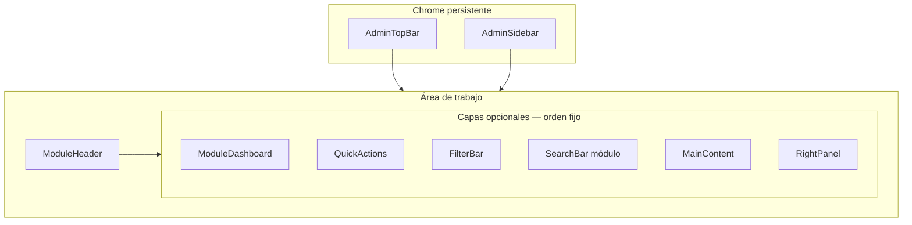

# OT-UX-BLUEPRINT-001 — Blueprint Estratégico del Nuevo Centro SEM

| Atributo | Valor |
| --- | --- |
| Código | OT-UX-BLUEPRINT-001 |
| Estado | **Aprobado** (revisión final 2026-07-03) |
| Prioridad | Crítica |
| Tipo | UX / UI / Arquitectura Frontend / Design System |
| Dependencia | [OT-UX-AUDITORIA-001](./OT-UX-AUDITORIA-001.md) |
| Fecha | 2026-07-03 |
| Restricción | **Cero código** — solo análisis, arquitectura y diseño |
| Alcance | 100% módulos `/admin/*` · estándar AprendeHoy BackOffice |

---

## Declaración de cumplimiento

| Criterio de aceptación | Estado |
| --- | --- |
| No se modificó código fuente (`src/`, configs, APIs) | ✅ |
| No se implementó ningún cambio funcional | ✅ |
| Blueprint basado en código real + auditoría | ✅ |
| Cobertura 100% módulos administrativos | ✅ |
| Layout Maestro único definido | ✅ |
| Experience Kit Administrativo único definido | ✅ |
| Menú lateral definitivo especificado | ✅ |
| Roadmap por fases incluido | ✅ |

**Evidencia de revisión:** 32 rutas `page.tsx`, 61+ componentes admin, 33 primitivos UI, `ADMIN_PRIMARY_NAV` con permisos IAM (OT-IAM-SEM-001), `nav-access.ts`, `admin-ui.ts`, `CMS-UX-GUIDELINES.md`.

---

## Delta respecto a OT-UX-AUDITORIA-001

Hallazgos verificados en código **posterior** a la auditoría — el Blueprint se fundamenta en el estado **actual**:

| Tema | Auditoría (2026-07-03 AM) | Código actual verificado |
| --- | --- | --- |
| Rutas admin | 31 | **32** `page.tsx` |
| Permisos en nav | Algunos ítems sin `requiredAnyPermission` | **Todos** los ítems declaran permisos (`institutional.ts` L24–133) |
| Roles IAM | Nombres legacy (Tenant Owner, Editor) | **ROLE_CODES** oficiales (`super_admin`, `communications`, etc.) |
| Etiquetas UI | Director General / Editor | **Super Admin** / **Comunicaciones** (`INSTITUTIONAL_ROLE_LABELS`) |
| Invitaciones | Por nombre interno | Por **código** (`CMS_INVITE_ROLES`) |
| Docs CMS-UX | Lista nav sin Asuntos estudiantiles | Código incluye **Asuntos estudiantiles** — **drift documental** |
| Institución layout | Sidebar propio | `ConfigurationLayout` usa **triple capa**: `AdminModuleLayout` + `AdminModuleHero` + sección |

---

# 1. Filosofía UX

## 1.1 Principio rector

> El Centro SEM no debe ser “bonito”. Debe ser **rápido, predecible y imposible de usar mal** para quien trabaja 4–8 horas diarias en él.

## 1.2 Pilares (orden de prioridad)

| # | Pilar | Implicación de diseño |
| ---: | --- | --- |
| 1 | **Productividad** | ≤3 clics a tareas diarias; atajos ⌘K; tablas con acciones en fila |
| 2 | **Consistencia** | Un layout, un header, un sistema de cards/tablas/badges |
| 3 | **Simplicidad** | Un H1 por pantalla; sin jerga técnica (CMS-UX-GUIDELINES) |
| 4 | **Escalabilidad** | Componentes composables para futuros módulos ERP AprendeHoy |
| 5 | **Bajo aprendizaje** | Sidebar estable; mismos patrones en todos los módulos |
| 6 | **Confianza** | Estados de guardado visibles; confirmaciones explícitas |

## 1.3 Anti-patrones actuales a eliminar (evidencia código)

| Anti-patrón | Evidencia | Impacto |
| --- | --- | --- |
| Triple título | `AdminPageFrame` + `AdminModuleHero` + H2 welcome (`AdminDashboardClient`, `ConfigurationLayout`) | Fatiga visual, scroll innecesario |
| Nav horizontal 11 ítems | `AdminInstitutionalHeader` L72–98 | Saturación, wrap inconsistente |
| `window.confirm` | 7 usos en forms/programs/student-affairs | Rompe experiencia SaaS |
| Búsqueda ⌘K falsa | `AdminGlobalSearch` filtra solo 6 enlaces estáticos | Expectativa incumplida |
| Tablas ad-hoc | 4 implementaciones `<table>` sin primitivo | Inconsistencia, no responsive |
| CSS heroes triplicado | `admin-module-center.css`, `admin-forms-center.css`, `sa-ops` | Deuda visual |
| Código huérfano | `ProgramsHubClient` + `admin-programs-hub.css` sin ruta | Confusión equipo |

## 1.4 Inspiración (principios, no copia)

| Referencia | Principio adoptado | Aplicación SEM |
| --- | --- | --- |
| **Linear** | Sidebar fija, densidad controlada, atajos | Nav lateral + ⌘K real en Fase 2 |
| **Stripe** | Topbar utilitaria; contenido con max-width | Separar utilidades de navegación |
| **Notion** | Sidebar colapsable; jerarquía por indentación | Sub-menús Portal/Comunicaciones/Admin |
| **Vercel** | Breadcrumbs sutiles; acciones arriba-derecha | `ModuleHeader` estándar |
| **HubSpot** | Hubs con cards de acceso | Comunicaciones, Inicio |
| **Firebase** | Árbol de recursos bajo módulo padre | Portal › Formularios › Convocatoria |
| **M365 Admin** | Agrupación por función institucional | Separar cuenta vs administración institucional |

---

# 2. Arquitectura general

## 2.1 Diagrama de sistema objetivo



## 2.2 Separación de responsabilidades

| Zona | Contiene | NO contiene |
| --- | --- | --- |
| **TopBar** | Logo, tenant, estado, ⌘K, notificaciones, perfil, acciones globales | Links a módulos |
| **Sidebar** | Navegación funcional completa | Formularios, tablas |
| **ModuleHeader** | Breadcrumb, H1, descripción, acciones primarias del módulo | Stats, filtros |
| **Workspace** | Contenido del módulo según plantilla | Nav global |

## 2.3 Mapa de rutas (estado real — 32 pantallas)

Ver inventario completo en [OT-UX-AUDITORIA-001 §1.2](./OT-UX-AUDITORIA-001.md). Rutas legacy a mantener (solo redirect visual en implementación futura):

- `/admin/experience/forms` → `/admin/portal/forms`
- `/admin/settings/team` → `/admin/settings/users`
- `/admin/design-system` → `/internal/design-system`

---

# 3. Layout Maestro

## 3.1 Estructura obligatoria

Toda pantalla admin (excepto login y canvas full-bleed) **DEBE** seguir este orden vertical:

```
① AdminTopBar          — fijo, z-index 50, h-14 (56px)
② AdminSidebar         — fijo izquierda, z-index 40
③ ModuleHeader         — breadcrumb + H1 + acciones
④ ModuleDashboard      — opcional: KPIs / resumen (solo hubs y inicio)
⑤ QuickActions         — opcional: grid 2–4 accesos
⑥ SearchBar            — opcional: búsqueda contextual del módulo
⑦ FilterBar            — opcional: filtros + orden + vista
⑧ MainContent          — obligatorio
⑨ RightPanel           — opcional: inspector, preview, detalle (drawer en móvil)
```

## 3.2 Excepciones justificadas

| Pantalla | Excepción | Razón |
| --- | --- | --- |
| `/admin/login` | Sin chrome | Seguridad, foco único |
| `/admin/pages/[id]` (builder) | Sin ModuleDashboard/FilterBar; toolbar propia | `VISUAL-EXPERIENCE-BUILDER.md` — canvas 3 columnas |
| `/admin/experience-studio` | MainContent full-bleed | Canvas visual |
| `/admin/portal/admission` | RightPanel = preview iframe sticky | Patrón split editor/preview |
| `/admin/portal/forms/[id]` | Tabs reemplazan FilterBar | Editor multi-panel |

## 3.3 Wireframe Layout Maestro (desktop)

```
┌──────────────────────────────────────────────────────────────────────────┐
│ [◇ SEM]  Seminario IPN · tenant     🟢 Activo   🔔  ⌘K Buscar   👤 MS ▾ │  ← TopBar 56px
├────────────┬─────────────────────────────────────────────────────────────┤
│            │ Inicio › Comunicaciones › Noticias                           │
│  SIDEBAR   │ Noticias institucionales          [+ Nueva noticia] [···]   │  ← ModuleHeader
│  240px     ├─────────────────────────────────────────────────────────────┤
│            │ ┌──────┐ ┌──────┐ ┌──────┐ ┌──────┐                        │
│ ● Inicio   │ │  24  │ │  3   │ │  1   │ │  18  │                        │  ← ModuleDashboard
│ ○ Instit.  │ │Total │ │Borr. │ │Prog. │ │Pub.  │                        │
│ ▾ Portal   ├─────────────────────────────────────────────────────────────┤
│ ○ Progr.   │ [Buscar por título…]  [Estado ▾] [Categoría ▾] [Orden ▾]   │  ← FilterBar
│ ○ Admisión ├─────────────────────────────────────────────────────────────┤
│ ○ Asuntos  │ ┌─────────────────────────────────────────────────────────┐│
│ ▾ Comunic. │ │ DataTable · filas · acciones · paginación               ││  ← MainContent
│ ○ Personas │ └─────────────────────────────────────────────────────────┘│
│ ○ Medios   │                                                             │
│ ▾ Admin    │                                                             │
│ ─────────  │                                                             │
│ ? Ayuda    │                                                             │
│ 👤 Marco   │                                                             │
└────────────┴─────────────────────────────────────────────────────────────┘
```

## 3.4 Tokens de layout (nuevos — spec, no implementados)

| Token | Valor | Fuente actual relacionada |
| --- | --- | --- |
| `--admin-topbar-h` | `56px` | Header ~48px + nav row |
| `--admin-sidebar-w` | `240px` | `ConfigurationLayout` sidebar `lg:w-64` (256px) → estandarizar 240 |
| `--admin-sidebar-collapsed` | `72px` | Nuevo |
| `--admin-content-max` | `80rem` | `max-w-[90rem]` en header |
| `--admin-workspace-p` | `var(--space-md)` | `spacing.md` = 16px |
| `--admin-section-gap` | `var(--space-lg)` | 24px entre secciones |

---

# 4. Sidebar definitivo

## 4.1 Estructura completa

```
Centro SEM
─────────────────────────────────────
🏠  Inicio                          /admin
🏛  Institución                     /admin/config
🌐  Portal                    [▾]
    ├ Páginas del sitio              /admin/pages
    ├ Menús de navegación            /admin/menus
    ├ Formularios y convocatorias    /admin/portal/forms
    └ Experience Studio              /admin/experience-studio
🎓  Programas y cursos               /admin/content/programs
📝  Centro de admisión               /admin/portal/admission
👥  Asuntos estudiantiles      [▾]
    ├ Panel operativo                /admin/portal/asuntos-estudiantiles
    └ Equipo y permisos              /admin/portal/asuntos-estudiantiles/equipo
📢  Comunicaciones              [▾]
    ├ Hub editorial                  /admin/content
    ├ Noticias                       /admin/content/news
    ├ Eventos                        /admin/content/events
    ├ Biblioteca                     /admin/content/library
    ├ Agenda académica               /admin/content/academic-agenda
    ├ Avisos                         /admin/content/avisos
    ├ Testimonios                    /admin/content/testimonials
    ├ Galería                        /admin/content/gallery
    └ Categorías                     /admin/content/categories
👤  Personas                         /admin/content/people
🖼  Medios                           /admin/media
⚙  Administración              [▾]
    ├ Usuarios e invitaciones        /admin/settings/users
    ├ Integraciones (almacenamiento) /admin/settings/integrations
    ├ Workflows                      /admin/workflows
    └ Event Bus                      /admin/events
─────────────────────────────────────
❓  Ayuda                            /admin/settings/help
👤  Marco Sepúlveda · Super Admin    → menú: Perfil, Seguridad, Actividad, Salir
```

## 4.2 Comportamiento

| Estado | Desktop ≥1280 | Notebook 1024–1279 | Tablet/Mobile <1024 |
| --- | --- | --- | --- |
| **Expandido** | 240px fijo, texto + icono | 240px o colapsado user-toggle | Overlay drawer |
| **Colapsado** | 72px, solo iconos + tooltip | Default colapsado | N/A (drawer) |
| **Sub-menú** | Acordeón inline; 1 abierto a la vez | Igual | Drawer con indentación |
| **Activo** | `bg-primary text-inverse` + barra izquierda 3px | Igual | Igual |
| **Persistencia** | `localStorage` key `sem-sidebar-collapsed` | Igual | — |

## 4.3 Iconografía (Lucide — alineado a `icon` en nav)

| Ítem | Icono Lucide | `ADMIN_PRIMARY_NAV.icon` actual |
| --- | --- | --- |
| Inicio | `Home` | `home` |
| Institución | `Building2` | `institution` |
| Portal | `Globe` | `portal` |
| Programas | `GraduationCap` | `programs` |
| Admisión | `ClipboardList` | `admission` |
| Asuntos est. | `UsersRound` | `students` |
| Comunicaciones | `Megaphone` | `communications` |
| Personas | `UserCircle` | `people` |
| Medios | `Image` | `media` |
| Administración | `Settings` | `admin` |
| Ayuda | `HelpCircle` | — (nuevo) |

## 4.4 Visibilidad por permisos (sin cambiar permisos — solo UI)

Fuente: `filterAdminNav` + `requiredAnyPermission` por ítem.

| Ítem sidebar | Permiso mínimo (cualquiera) |
| --- | --- |
| Inicio | `cms.pages.read` \| `settings.team` \| `student-affairs.read` |
| Institución | `settings.update` |
| Portal | `cms.pages.*` \| `cms.menus.read` \| `experience.forms.*` |
| Programas | `programs.manage` \| `cms.pages.read` |
| Admisión | `cms.pages.read` \| `experience.forms.*` \| `students.read` |
| Asuntos estudiantiles | `student-affairs.*` |
| Comunicaciones | `cms.pages.*` \| `news.publish` \| `content.events.manage` \| `programs.manage` |
| Personas | `cms.pages.*` \| `programs.manage` |
| Medios | `cms.media.read` \| `cms.media.upload` |
| Administración | `settings.team` \| `identity.audit.read` \| `workflow.read` |

**Rol acotado:** `isStudentAffairsOnlyUser` → sidebar muestra solo **Inicio** + **Asuntos estudiantiles** (evidencia: `nav-access.ts` L40–44).

## 4.5 Addendum OT-UX-PROTOTIPO-001 (2026-07-03)

El prototipo visual adopta la **navegación ERP objetivo** solicitada en OT-UX-PROTOTIPO-001. Esta sección no reemplaza §4.1 (Fase 1 implementable); documenta la visión validada en mockups.

| Agrupación prototipo | Ítems | Fase | Ruta actual / futura |
| --- | --- | --- | --- |
| Dashboard | Dashboard | **1** | `/admin` |
| Académico | Programas | **1** | `/admin/content/programs` |
| Académico | Cursos, Mallas, Docentes | ERP | — |
| Admisión | Formularios | **1** | `/admin/portal/forms` |
| Admisión | CRM, Postulantes, Matrículas | ERP | admission parcial `/admin/portal/admission` |
| Estudiantes | Asistencia | **1** | `/admin/portal/asuntos-estudiantiles` |
| Estudiantes | Expedientes, Certificados, Historial | ERP | — |
| Administración | + Roles | **1** | `/admin/settings/roles` (33ª ruta, post-auditoría) |

**Delta código verificado:** 33 rutas `page.tsx` (Blueprint §2.3 decía 32). Etiqueta UI: **Dashboard** (no «Inicio») en prototipo aprobado.

## 4.6 Arquitectura de plataforma (post-aprobación 2026-07-03)

El Shell Administrativo V2 es el **BackOffice oficial de AprendeHoy**, no un shell exclusivo del SEM.

| Principio | Implementación |
| --- | --- |
| Multi-tenant | Un único shell; contenido de chrome según tenant activo |
| Branding dinámico | Logo, nombre, colores desde CMS/branding del tenant (`--brand-*` → UI) |
| Wordmark | «Centro [Institución]» o nombre configurado — no hardcodear «SEM» |
| Escalabilidad nav | Sidebar organizado por **dominios de producto** (ver §4.7) |

## 4.7 Dominios funcionales del Sidebar (escalable)

La navegación responde a dominios del producto AprendeHoy, independientes de un tenant concreto:

| Dominio | Propósito | Ejemplo ítems (tenant portal) |
| --- | --- | --- |
| **workspace** | Punto de entrada operativo | Dashboard |
| **institution** | Identidad y configuración del tenant | Institución |
| **portal** | Sitio público y experiencia | Portal (páginas, menús, studio) |
| **academic** | Oferta formativa | Programas → Cursos, Mallas, Docentes (ERP) |
| **admissions** | Captación y postulación | Formularios, CRM, Postulantes, Matrículas |
| **students** | Vida estudiantil | Asuntos estudiantiles, Asistencia, Expedientes |
| **communications** | Contenido editorial | Comunicaciones (hub) |
| **directory** | Personas institucionales | Personas |
| **media** | Activos digitales | Medios |
| **platform** | Operación del tenant en la plataforma | Administración (usuarios, roles, integraciones) |
| **support** | Ayuda y cuenta | Ayuda, Perfil |

**Reglas de extensión:** nuevos módulos ERP se agregan bajo su dominio; ítems sin permiso se ocultan (no disabled); sub-menús por acordeón; configuración declarativa en `admin-nav.ts` (futuro) desacoplada de rutas hardcodeadas por tenant.

---

# 5. TopBar definitiva

## 5.1 Anatomía

```
┌─────────────────────────────────────────────────────────────────────────┐
│ [≡ colapsar]  Centro SEM · Seminario IPN    🟢 Portal  🟡 CMS  🔔  ⌘K  👤 │
└─────────────────────────────────────────────────────────────────────────┘
```

| Slot | Componente actual | Componente blueprint |
| --- | --- | --- |
| Toggle sidebar | `AdminNavDrawer` button (solo móvil) | `AdminSidebarToggle` (todos) |
| Marca | Link "Centro SEM" | Logo isotipo + nombre tenant |
| Estado | `AdminStatusBadges` | `SystemStatusCluster` (máx 2 badges) |
| Notificaciones | Link `/settings/notifications` | `NotificationBell` + badge count |
| Actividad | Link `/settings/activity` | Mover a menú usuario o unificar con notificaciones |
| Búsqueda | `AdminGlobalSearch` | `GlobalCommandPalette` (Fase 2: búsqueda real) |
| Perfil | `AdminUserMenuPanel` | `AdminUserMenu` |

## 5.2 Menú usuario (separar cuenta vs institución)

| Sección | Ítems |
| --- | --- |
| Cuenta | Mi perfil · Seguridad · Actividad |
| Institución | Solo si `settings.team`: Usuarios · Integraciones |
| Sesión | Ver portal público · Cerrar sesión |

---

# 6. Experience Kit Administrativo (AEK v1)

Extiende `src/components/ui` (Experience Kit portal). **No reemplaza** primitivos — los compone.

## 6.1 Jerarquía de dependencias

```
src/components/ui/*          ← Primitivos base (Button, Card, Modal…)
src/components/admin/kit/*   ← AEK v1 (NUEVO en implementación)
src/components/admin/*       ← Módulos (migran a usar kit)
```

## 6.2 Catálogo oficial

### Navegación

| Componente | Cuándo usar | Cuándo NO | Base actual |
| --- | --- | --- | --- |
| **AdminSidebar** | Siempre en shell v2 | Login, builder fullscreen | `AdminNavDrawer` (parcial) |
| **AdminTopBar** | Siempre en shell v2 | Login | `AdminInstitutionalHeader` |
| **AdminBreadcrumb** | Todas las pantallas con profundidad ≥2 | Inicio (solo "Inicio") | `Breadcrumb` UI |
| **ModuleHeader** | **Un único** H1 por vista | Dentro de cards/tabs | `AdminModuleLayout` header zone |

### Dashboard

| Componente | Cuándo usar | Variantes |
| --- | --- | --- |
| **KpiCard** | Métrica numérica única con tendencia opcional | `total`, `active`, `pending`, `neutral` |
| **ProgressCard** | Progreso hacia meta (convocatorias, publicación) | barra + % |
| **SummaryCard** | Texto + icono + enlace | bienvenida, alertas |
| **MetricCard** | KPI + sparkline (futuro) | reservado Fase 4 |

**Reemplaza:** `StatCard` inline en `AdminDashboardClient`, `AdminModuleStats` custom.

### Datos

| Componente | Cuándo usar | Especificación |
| --- | --- | --- |
| **DataTable** | Listados ≥5 filas con columnas comparables | sort, sticky header, row actions, empty, skeleton |
| **FilterBar** | Listados con ≥2 filtros | chips + dropdowns + reset |
| **SearchBar** | Búsqueda dentro del módulo | debounce 300ms, clear button |
| **EmptyState** | Cero resultados / módulo vacío | ilustración + título + CTA |
| **LoadingState** | Fetch inicial | skeleton rows o cards |

**Reemplaza:** 4 tablas raw (`FormSubmissionsPanel`, `ConvocatoriaAdminPanel`, `ConvocatoriaRosterPanel`, `StudentAffairsOperationsPanel`).

### Acciones

| Componente | Cuándo usar |
| --- | --- |
| **QuickActions** | Hubs (Inicio, Comunicaciones) — grid 2×2 o 4 col |
| **ConfirmDialog** | Toda acción destructiva (reemplaza `window.confirm`) |
| **FloatingActions** | Solo móvil: CTA primaria fija bottom-right |

### Estados

| Componente | Cuándo usar | Base |
| --- | --- | --- |
| **AdminBadge** | Estados semánticos unificados | Extiende UI `Badge` |
| **AdminAlert** | Banners inline persistentes | UI `Alert` |
| **AdminToast** | Feedback transitorio post-acción | **No existe** — crear |
| **AdminTimeline** | Auditoría, actividad | `AuditTimeline` |

**Eliminar:** `StatusPill` local ×3, `AbsenceReviewBadge` ×3 → `AdminBadge` variant `attendance-*`.

### Layout

| Componente | Cuándo usar |
| --- | --- |
| **Section** | Agrupación con título opcional + `section-gap` |
| **AdminCard** | Wrapper sobre UI `Card` — variantes `stat`, `entity`, `action` |
| **Panel** | Contenedor con borde para sub-áreas (inspector, filtros) |
| **AdminDrawer** | Detalle lateral (medios, roster) — extiende UI `Drawer` |

## 6.3 Matriz de decisión: Card vs Table vs List

| Criterio | Card grid | DataTable |
| --- | --- | --- |
| Campos visibles | ≤4 | ≥5 columnas |
| Acción principal | Navegar a detalle | Acciones en fila + bulk |
| Ejemplos SEM | Personas, Usuarios CMS, Medios grid | Submissions, roster, ops asuntos est. |
| Densidad | Baja–media | Alta |

---

# 7. Wireframes por módulo

> Escala: desktop 1280px. Móvil: sidebar → drawer; tablas → card list.

---

## 7.1 🏠 Inicio

**Ruta:** `/admin` · **Componentes actuales:** `AdminPageFrame`, `AdminDashboardClient`, `AdminModuleHero`

```
ModuleHeader: "Buenos días, {nombre}" · {rol} · Último acceso
ModuleDashboard: [KpiCard ×4] Noticias | Programas | Usuarios | Invitaciones
QuickActions: [rol-aware] Publicar noticia | Nuevo formulario | Ver actividad | Invitar usuario
MainContent:
  ├ Section "Actividad reciente" → AdminTimeline (6 ítems) + link "Ver todo"
  └ Section "Accesos directos" → grid 4 col (solo si rol admin)
```

**Mejora productividad:** Eliminar `AdminModuleHero` duplicado; KPIs clicables.

---

## 7.2 🏛 Institución

**Ruta:** `/admin/config` · **8 secciones** (`CONFIG_SECTIONS`)

```
ModuleHeader: "Institución" · Guardar sticky en TopBar zona derecha del header
Layout: Split
  ├ Sidebar interno 200px (secciones — reutilizar patrón ConfigurationLayout)
  └ MainContent: formulario sección activa
RightPanel: — 
Footer fijo: SaveBar (estado + Guardar cambios) — reemplaza botón perdido al scroll
```

**Secciones:** general · branding · seo · contact · social · features · experience · status

---

## 7.3 🌐 Portal

### 7.3a Páginas (`/admin/pages`)

```
ModuleHeader: "Páginas del portal" · [+ Nueva página]
FilterBar: [Buscar] [Estado ▾] [Plantilla ▾]
MainContent: DataTable — Título | Slug | Estado | Actualizado | Acciones
```

### 7.3b Editor (`/admin/pages/[id]`) — EXCEPCIÓN

```
BuilderToolbar: Guardar | Vista previa | Publicar | Historial
Layout 3 col: Estructura | Canvas portal | Inspector
(Sin ModuleDashboard — spec VISUAL-EXPERIENCE-BUILDER)
```

### 7.3c Formularios (`/admin/portal/forms`)

```
ModuleHeader: "Formularios y convocatorias"
ModuleDashboard: [activos] [borradores] [respuestas hoy]
MainContent:
  ├ Featured cards (máx 3) — convocatorias activas
  └ DataTable resto formularios
```

### 7.3d Detalle formulario (`/admin/portal/forms/[id]`)

```
ModuleHeader: {nombre formulario} · [Publicar] [Vista previa]
Tabs: Experiencia | Campos | Respuestas | Convocatoria | SEO
MainContent: panel tab activo
```

---

## 7.4 🎓 Programas y cursos

**Ruta:** `/admin/content/programs` (hoy listado simple; blueprint activa hub)

```
ModuleHeader: "Programas y cursos" · [+ Nuevo programa]
FilterBar: [Buscar] [Estado ▾] [Modalidad ▾] [Orden ▾]
ModuleDashboard: [publicados] [borradores] [destacados]
MainContent: grid AdminCard (ProgramHubCard unificado) — cablear ProgramsHubClient
```

---

## 7.5 📝 Centro de admisión

**Ruta:** `/admin/portal/admission`

```
ModuleHeader: "Centro de admisión" · [Vista previa portal]
Layout split 45/55:
  ├ MainContent: acordeón secciones (Hero | Programas | Cierre | …)
  └ RightPanel: iframe preview sticky + breakpoint selector
```

---

## 7.6 👥 Asuntos estudiantiles

**Rutas:** `/admin/portal/asuntos-estudiantiles` · `/equipo` · `/[formId]`

### Home asuntos

```
ModuleHeader: "Asuntos estudiantiles"
ModuleDashboard: convocatorias activas con ProgressCard (inscritos/meta)
MainContent: DataTable convocatorias → link a ops
```

### Ops (`/[formId]`)

```
ModuleHeader: {convocatoria} · [Exportar]
FilterBar: [Buscar estudiante] [Asistencia ▾] [Generación ▾]
MainContent: DataTable — Estudiante | Email | Asistencia | Justificación | Acciones
```

---

## 7.7 📢 Comunicaciones

**Ruta hub:** `/admin/content`

```
ModuleHeader: "Comunicaciones"
QuickActions: 6 primary (programs, news, library, people, admission, forms) — CONTENT_EDITORIAL_PRIMARY
MainContent:
  ├ Section "Principales" → card grid 3 col
  └ Section "Más secciones" → card grid 3 col — CONTENT_EDITORIAL_SECONDARY
```

**Sub-rutas** (`/admin/content/news`, etc.):

```
ModuleHeader: {sección} · [+ Crear]
FilterBar: [Buscar] [Estado ▾] [Categoría ▾]
MainContent: DataTable o card grid según sección
```

---

## 7.8 👤 Personas

**Ruta:** `/admin/content/people`

```
ModuleHeader: "Personas" · [+ Nueva persona]
FilterBar: [Grupo ▾] leadership | docente | técnico
MainContent: card grid retrato — PortalPersonCard unificado
```

**Editor:** `/admin/content/people/edit/[id]` — form 1 col + MediaField foto

---

## 7.9 🖼 Medios

**Ruta:** `/admin/media`

```
ModuleHeader: "Biblioteca de medios" · [Subir archivo]
FilterBar: [Buscar] [Carpeta ▾] [Tipo ▾] — MEDIA_LIBRARY_QUICK_LINKS
MainContent: grid masonry
RightPanel (drawer en móvil): detalle asset seleccionado
```

---

## 7.10 ⚙ Administración

### Usuarios (`/admin/settings/users`)

```
ModuleHeader: "Usuarios e invitaciones" · [Invitar usuario]
FilterBar: [Grupo ▾] — CMS_USER_GROUPS por roleCode
MainContent: UserCmsCard grid → migrar a AdminCard entity
Secondary: invitaciones pendientes + AuditTimeline
```

### Integraciones (`/admin/settings/integrations`)

```
ModuleHeader: "Integraciones"
MainContent: Card Backblaze B2 (StorageIntegrationsClient) — ya usa UI Card ✅
```

### Workflows / Events

```
ModuleHeader: "Workflows" / "Event Bus"
MainContent: AdminSystemPanel simplificado — DataTable eventos
```

---

# 8. Arquitectura de navegación

## 8.1 Profundidad actual vs objetivo

| Flujo | Clics hoy | Clics objetivo | Cómo |
| --- | ---: | ---: | --- |
| Publicar noticia | 4 (nav→comunic→news→new) | 2 | ⌘K "noticias" + sidebar sub-item |
| Editar programa | 3 | 2 | Sidebar Programas directo |
| Registrar asistencia | 4 | 2 | Sidebar Asuntos → convocatoria |
| Invitar usuario | 3 | 2 | Inicio QuickAction o Admin sub-item |
| Configurar B2 | 3 | 2 | Admin → Integraciones en sidebar |
| Crear formulario | 4 | 2 | Portal sub-nav → Formularios |

## 8.2 Redundancias a resolver (solo reorganización visual)

| Redundancia | Resolución blueprint |
| --- | --- |
| Programas en nav + Comunicaciones hub | Nav: **Programas** directo; hub comunicaciones sin duplicar card programas como primario |
| Personas en nav + hub comunicaciones | Nav: **Personas** directo; hub mantiene card secundaria |
| Equipo legacy `/content/team` | Sidebar Personas; legacy oculto de nav |
| Actividad en topbar + settings | Unificar en notificaciones o menú usuario |

## 8.3 Breadcrumbs — reglas definitivas

1. Siempre empiezan en **Inicio** (`/admin`)
2. Máximo **4 niveles** visibles
3. Sidebar expande sub-menú según breadcrumb activo
4. Último segmento sin link

Ejemplo: `Inicio › Portal › Formularios › Jornada Talca`

---

# 9. Productividad — flujos críticos

## 9.1 Buscar estudiante (asuntos estudiantiles)

| Paso | Hoy | Blueprint |
| --- | --- | --- |
| 1 | Nav → Asuntos estudiantiles | Sidebar directo |
| 2 | Click convocatoria | DataTable con búsqueda inline |
| 3 | Scroll tabla ancha | FilterBar + SearchBar estudiante |
| 4 | — | ⌘K futuro: "estudiante {nombre}" cross-módulo |

## 9.2 Crear formulario

| Paso | Hoy | Blueprint |
| --- | --- | --- |
| 1–2 | Nav Portal → scroll forms | Sidebar Portal › Formularios |
| 3 | Crear → `CreateFormDialog` Modal ✅ | Mantener Modal |
| 4 | Editor tabs | Mantener; añadir SaveBar |

## 9.3 Editar programa

| Paso | Hoy | Blueprint |
| --- | --- | --- |
| 1 | Nav Programas (o Comunicaciones→programs) | Solo sidebar Programas |
| 2 | Click fila | DataTable row → editor |
| 3 | Guardar | SaveBar sticky |

## 9.4 Enviar comunicación (noticia)

| Paso | Hoy | Blueprint |
| --- | --- | --- |
| 1 | Comunicaciones → Noticias | Sidebar Comunicaciones › Noticias o ⌘K |
| 2 | Nueva | ModuleHeader CTA |
| 3 | Publicar | Editor + estado visible |

## 9.5 Registrar asistencia

| Paso | Hoy | Blueprint |
| --- | --- | --- |
| 1–3 | Asuntos → convocatoria → tabla | 2 clics + FilterBar asistencia |
| Acción | Inline en tabla | DataTable con toggle asistencia + ConfirmDialog |

## 9.6 Administrar usuarios

| Paso | Hoy | Blueprint |
| --- | --- | --- |
| 1 | Admin → users | Sidebar Admin › Usuarios |
| 2 | Invitar | ModuleHeader CTA → wizard (mantener flujo) |
| 3 | Cambiar rol | Inline en card → dropdown con ConfirmDialog |

---

# 10. Auditoría visual

## 10.1 Tipografía actual

| Elemento | Clase actual | Blueprint |
| --- | --- | --- |
| H1 módulo | `text-2xl font-semibold` | `text-xl font-semibold` — **único** |
| Hero interno | `AdminModuleHero` grande | Eliminar como capa separada |
| H2 sección | `text-2xl` en welcome card | `text-base font-medium` |
| Body | `text-sm` | `text-sm` ✅ |
| Meta | `text-xs text-muted` | `text-xs text-muted` ✅ |
| Font family | Manrope (DS) | Mantener |

## 10.2 Espaciado

| Área | Actual | Inconsistencia | Estándar blueprint |
| --- | --- | --- | --- |
| Module padding | `px-4 py-5 sm:px-6` | OK | `--admin-workspace-p` |
| Section gap | `gap-4` / `gap-6` mixto | Media | `--admin-section-gap` fijo 24px |
| Card padding | `p-4` / `p-6` / `p-8` | Alta | `p-4` default, `p-6` hero |
| Table cell | `px-3 py-2` ad-hoc | Alta | `px-4 py-3` estándar |

## 10.3 Color y contraste

- Tokens semánticos en `src/design/tokens/colors.ts` — **correctos**
- `adminUi` mezcla `dark:` legacy con tokens — **migrar a tokens únicos**
- Badges: UI `Badge` + custom pills — **unificar AdminBadge**

## 10.4 Botones

- UI `Button` con 6 variantes — **usar siempre**
- `adminUi.primaryBtn` en ConfigurationHub — **migrar a Button**
- Acciones destructivas: `variant="danger"` + ConfirmDialog

## 10.5 Iconografía

- Lucide en header y módulos ✅
- Secciones config usan unicode (`◎`, `◆`) — **migrar a Lucide** en blueprint
- Nav desktop sin iconos — **sidebar siempre con icono + label**

---

# 11. Responsive

| Breakpoint | Ancho | Sidebar | TopBar | Tablas | ModuleHeader |
| --- | --- | --- | --- | --- | --- |
| **Desktop** | ≥1280 | Fija 240px | Completa | DataTable full | Acciones derecha |
| **Notebook** | 1024–1279 | Colapsada 72px default | Completa | DataTable scroll | Acciones wrap |
| **Tablet** | 768–1023 | Drawer overlay | Compacta | Card list | Acciones menú ··· |
| **Mobile** | <768 | Drawer | Solo logo + perfil + ⌘K | Card list | CTA FloatingActions |

**Evidencia gap actual:** Nav horizontal oculta `< lg`; drawer solo móvil — desktop sin alternativa sidebar.

---

# 12. Inventario de componentes (consolidado)

## 12.1 Reutilizables — mantener y extender

| Componente | Path | Acción blueprint |
| --- | --- | --- |
| `AdminModuleLayout` | `admin/AdminModuleLayout.tsx` | Evoluciona a shell parcial → `ModuleHeader` + slots |
| `AdminQuickActions` | `admin/AdminModuleLayout.tsx` | Mover a AEK |
| `AuditTimeline` | `admin/AuditTimeline.tsx` | → `AdminTimeline` |
| `InviteUserWizard` | `admin/InviteUserWizard.tsx` | Mantener flujo |
| `StorageIntegrationsClient` | `admin/StorageIntegrationsClient.tsx` | Modelo de uso UI Card |
| `ConfigurationLayout` | `config/ConfigurationLayout.tsx` | Modelo sidebar secciones |
| Builders (11) | `admin/builders/*` | Mantener; unificar shell |
| UI Kit (33) | `components/ui/*` | Base inmutable |

## 12.2 Duplicados — consolidar en implementación

| Grupo | Instancias | Target AEK |
| --- | --- | --- |
| Cards | UI Card, StatCard, UserCmsCard, ProgramHubCard, inline | `AdminCard` |
| Badges | Badge, StatusPill, AbsenceReviewBadge×3, AdminStatusBadges | `AdminBadge`, `SystemStatusCluster` |
| Heroes CSS | module-center, forms-center, sa-ops | `ModuleHeader` only |
| Tablas | 4 raw tables | `DataTable` |
| Diálogos | Modal×2, confirm×7 | `ConfirmDialog` |
| Sidebars | NavDrawer, Config sidebar, Module aside | `AdminSidebar` global |

## 12.3 Huérfanos — decisión

| Asset | Decisión |
| --- | --- |
| `ProgramsHubClient.tsx` | **Activar** en `/admin/content/programs` Fase 3 |
| `admin-programs-hub.css` | Importar al activar hub |
| `/admin/experience/forms` | Redirect permanente (ya existe ruta) |
| `AudienceProfilesBuilder` | Añadir a barrel builders |

---

# 13. Reglas de diseño (Do / Don't)

## Do

- Un **solo H1** por vista (`ModuleHeader`)
- Breadcrumbs en **todas** las pantallas con profundidad ≥2
- `ConfirmDialog` para acciones destructivas
- `EmptyState` con CTA en todo listado
- `SaveBar` sticky en formularios largos (Institución, Admisión, Formularios)
- Español institucional — sin términos técnicos (ver CMS-UX-GUIDELINES)
- Probar **4 breakpoints** antes de cerrar cada fase

## Don't

- No segundo hero debajo del ModuleHeader
- No `window.confirm` / `alert`
- No `<table>` raw fuera de `DataTable`
- No nav funcional en TopBar
- No cards inline Tailwind cuando existe `AdminCard`
- No crear CSS por módulo salvo excepción documentada (builder, admission preview)
- No big-bang redesign

---

# 14. Roadmap de implementación

> **OT autorizada:** [OT-UX-IMPLEMENTACION-001](../ot/OT-UX-IMPLEMENTACION-001.md). Cada fase = PR independiente + feature flag `ADMIN_SHELL_V2`.

### Ajustes post-aprobación prototipo (2026-07-03)

| Tema | Decisión |
| --- | --- |
| Alcance shell | **Plataforma AprendeHoy** multi-tenant — branding dinámico del tenant activo |
| Sidebar | Dominios funcionales del producto, no estructura exclusiva SEM |
| Layout Maestro | Obligatorio en **todas** las pantallas admin salvo excepción técnica documentada |
| AEK | Implementación **completa en Fase 2** antes de migrar módulos (Fase 3) |
| Fases | 4 fases oficiales (ver OT-UX-IMPLEMENTACION-001) |

| Fase | Duración est. | Entregable | Riesgo |
| --- | ---: | --- | --- |
| **1** | 2–3 sem | Shell V2: Sidebar, TopBar, Breadcrumbs, Layout Maestro, responsive — **sin migrar módulos** | Medio |
| **2** | 2–3 sem | AEK completo (incl. Sidebar, TopBar, DataTable, estados…) | Medio |
| **3** | 4–5 sem | Migración módulo a módulo (32+ rutas) | Alto |
| **4** | 1–2 sem | Performance, a11y, consistencia, responsive, documentación | Bajo |

**Esfuerzo total estimado:** 75–85 días-persona (sin cambio sustancial; reordenación Fase 1→2→3).

### Estimación por módulo

| Módulo | Días | Fase |
| --- | ---: | --- |
| Shell global | 12 | 1 |
| AEK primitivos | 14 | 2 |
| Inicio | 3 | 3 |
| Institución | 4 | 3 |
| Comunicaciones + sub-rutas | 8 | 3 |
| Personas | 3 | 3 |
| Medios | 3 | 3 |
| Portal formularios | 6 | 3 |
| Programas hub | 5 | 4 |
| Admisión | 5 | 4 |
| Asuntos estudiantiles | 4 | 4 |
| Administración | 4 | 4 |
| Portal páginas/menús/studio | 8 | 5 |
| QA + docs | 5 | 6 |

---

# 15. Riesgos técnicos y dependencias

## 15.1 Riesgos

| ID | Riesgo | Prob. | Impacto | Mitigación |
| --- | --- | --- | --- | --- |
| R1 | Regresión formularios/convocatorias | Media | Alto | Fase 3 dedicada + QA manual |
| R2 | Rol Student Affairs pierde acceso | Baja | Alto | Test `filterAdminNav` con sidebar |
| R3 | Builder 3-col incompatible con sidebar | Media | Medio | Excepción fullscreen documentada |
| R4 | Tablas responsive rompen ops diarias | Media | Alto | Card list móvil en DataTable |
| R5 | Drift docs vs código (nav, roles) | Alta | Bajo | Actualizar CMS-UX-GUIDELINES en Fase 6 |
| R6 | Big-bang pressure | Media | Crítico | Feature flag + fases estrictas |

## 15.2 Dependencias

| Dependencia | Tipo | Bloqueante |
| --- | --- | --- |
| Aprobación OT-UX-AUDITORIA-001 | Documental | ✅ Completada |
| Aprobación este Blueprint | Documental | Pendiente |
| OT-UX-IMPLEMENTACION-001 | Ejecución | Sí |
| OT-IAM-SEM-001 (ROLE_CODES) | Código existente | No — sidebar respeta permisos actuales |
| Experience Kit portal (`ui/`) | Código existente | No — se extiende |
| Capturas baseline | Asset | Recomendado antes Fase 1 |

## 15.3 Fuera de alcance (explícito)

- Cambiar permisos, roles o rutas
- Búsqueda global con índice full-text (Fase 2+ como mejora separada)
- Dark mode admin (tokens `dark:` en adminUi — no priorizar)
- Módulos ERP (teacher, finance, student) — ROLE_CODES reservados

---

# 16. Criterios de aprobación del Blueprint

- [x] Product owner valida sidebar y layout maestro
- [x] Equipo técnico valida fases y feature flag
- [ ] Capturas baseline en `docs/audits/assets/ot-ux-auditoria-001/` (recomendado, no bloqueante)
- [x] Actualización de `CMS-UX-GUIDELINES.md` planificada (Fase 4 implementación)
- [x] Creación de OT-UX-IMPLEMENTACION-001 autorizada

---

# 17. Referencias

| Documento | Relación |
| --- | --- |
| [OT-UX-AUDITORIA-001](./OT-UX-AUDITORIA-001.md) | Auditoría base |
| [CMS-UX-GUIDELINES.md](../design/CMS-UX-GUIDELINES.md) | Reglas composición (requiere sync nav) |
| [CMS-NAVIGATION-AUDIT.md](./CMS-NAVIGATION-AUDIT.md) | Auditoría nav histórica |
| [COMPONENTS.md](../design/COMPONENTS.md) | Specs Experience Kit portal |
| `src/lib/admin/institutional.ts` | Nav + permisos canónicos |
| `src/lib/admin/nav-access.ts` | Filtrado por rol |
| `src/core/identity/roles/codes.ts` | ROLE_CODES oficiales |
| `src/lib/admin/admin-ui.ts` | Clases admin legacy |

---

*Blueprint generado en cumplimiento de OT-UX-BLUEPRINT-001. Ningún archivo de código fuente fue modificado. La implementación requiere OT dedicada y aprobación explícita de este documento.*
