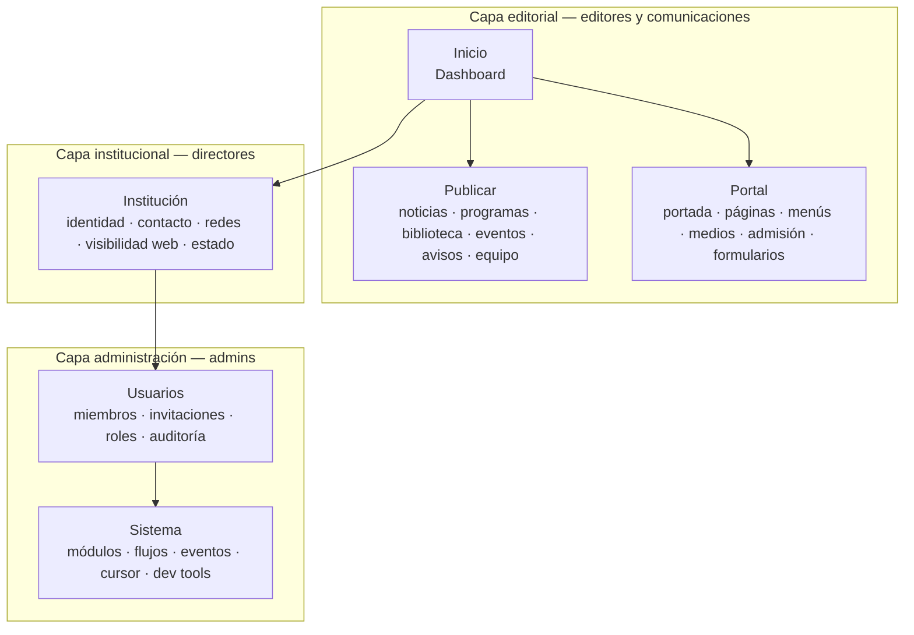

# PORTAL-CMS-AUDIT — Auditoría Integral del Centro de Administración del Portal

| Atributo | Valor |
| --- | --- |
| Código | OT-AUDIT-PORTAL-CMS-001 |
| Épica | EP-001A — Portal CMS |
| Prioridad | Muy Alta |
| Estado | Completada |
| Fecha | 2026-07-01 |
| Alcance | Panel `/admin/*`, APIs CMS, identidad, Content Engine, Page Builder |
| Método | 4 recorridos (Arquitectura · Contenido · Operación · Experiencia Visual) |
| Entregable nav | [CMS-NAVIGATION-AUDIT.md](./CMS-NAVIGATION-AUDIT.md) |
| Referencias | [EDITORIAL-AUDIT.md](./EDITORIAL-AUDIT.md) · [AUDIT-CORPORATE-BRANDING-001.md](./AUDIT-CORPORATE-BRANDING-001.md) · EP-000 Experience Kit |

> **Alcance explícito:** esta auditoría **no modifica código**. Identifica oportunidades, inconsistencias y define el rediseño del Portal CMS v2.

---

## Resumen ejecutivo

El Portal CMS del SEM es funcional como **panel técnico de configuración** de la plataforma AprendeHoy, pero **no cumple** el objetivo de un **Centro de Administración Editorial** para directores, editores, comunicaciones y administradores institucionales.

| Dimensión | Veredicto | Hallazgos críticos |
| --- | --- | --- |
| Arquitectura | 🔴 | Sin dashboard; 50 %+ rutas ocultas; colisión «Equipo» |
| Lenguaje | 🔴 | Jerga de desarrollador y plataforma en toda la UI |
| Flujo editorial | 🔴 | 9/11 colecciones sin editor; noticias no publicables |
| Usuarios / roles | 🟠 | Roles AprendeHoy mezclados con roles Portal |
| Diseño | 🟡 | Tokens SEM aplicados (OT-BRANDING-004) pero layouts divergentes |
| Seguridad | 🟠 | Modo compatibilidad bypass; permisos parciales en APIs |
| Accesibilidad | 🟠 | Sin nav móvil; breadcrumbs ausentes |
| Rendimiento | 🟡 | Recargas completas; queries secuenciales |

**Resultado esperado:** este documento habilita el diseño de **Portal CMS v2** con arquitectura clara, lenguaje institucional, navegación intuitiva y experiencia coherente con la identidad SEM.

---

## Metodología — cuatro recorridos

| Recorrido | Pregunta guía | Secciones de este documento |
| --- | --- | --- |
| **1 — Arquitectura** | ¿Los módulos están donde el usuario espera? | §2, §3, §11, [CMS-NAVIGATION-AUDIT](./CMS-NAVIGATION-AUDIT.md) |
| **2 — Contenido** | ¿Los textos ayudan o confunden? | §4 |
| **3 — Operación** | ¿Qué tan fácil es publicar o actualizar? | §5, §6, §10 |
| **4 — Experiencia Visual** | ¿El CMS transmite la calidad del portal público? | §7, §8 |

### Plantilla por pantalla

Cada pantalla se documentó con: **Captura · Objetivo · Qué funciona · Qué confunde · Qué eliminar · Qué mover · Qué agregar · Prioridad · Clasificación**.

Las capturas deben tomarse en recorrido manual y guardarse en `docs/audits/assets/cms/`.

---

## 1. Inventario de pantallas

| # | Ruta | Título UI actual | En nav principal | Editor funcional | Captura |
| ---: | --- | --- | :---: | :---: | --- |
| 1 | `/admin/login` | Ingresar al CMS | — | — | `01-login.png` |
| 2 | `/admin/config` | Configuration Hub | ✅ | Parcial | `02-config.png` |
| 3 | `/admin/content` | Contenido | ✅ | Hub | `03-content.png` |
| 4 | `/admin/content/programs` | Programas | — | ❌ Lista | `04-programs.png` |
| 5 | `/admin/content/news` | Noticias | — | ❌ Lista | `05-news.png` |
| 6 | `/admin/content/people` | Personas | — | ❌ Lista | `06-people.png` |
| 7 | `/admin/content/team` | Equipo (legacy) | — | ❌ Lista | `07-team-legacy.png` |
| 8 | `/admin/content/library` | Biblioteca | — | ❌ Lista | `08-library.png` |
| 9 | `/admin/content/events` | Eventos | — | ❌ Lista | `09-events.png` |
| 10 | `/admin/content/academic-agenda` | Agenda Académica | — | ✅ CRUD | `10-agenda.png` |
| 11 | `/admin/content/avisos` | Avisos Institucionales | — | ✅ CRUD | `11-avisos.png` |
| 12 | `/admin/content/testimonials` | Testimonios | — | ❌ Lista | `12-testimonials.png` |
| 13 | `/admin/content/gallery` | Galería | — | ❌ Lista | `13-gallery.png` |
| 14 | `/admin/content/categories` | Categorías | — | ❌ Lista | `14-categories.png` |
| 15 | `/admin/content/*/edit/[id]` | Editor contenido | — | Solo agenda/avisos | `15-editor.png` |
| 16 | `/admin/pages` | Constructor de Páginas | ✅ | Lista | `16-pages.png` |
| 17 | `/admin/pages/home` | Page Builder — Home | — | ✅ Bloques | `17-home-builder.png` |
| 18 | `/admin/pages/[id]` | Page Builder | — | ✅ Bloques | `18-page-builder.png` |
| 19 | `/admin/media` | Media Manager | ✅ | ✅ Completo | `19-media.png` |
| 20 | `/admin/menus` | Menús | ❌ | ✅ Completo | `20-menus.png` |
| 21 | `/admin/menus/[id]` | Editor de menú | ❌ | ✅ | `21-menu-editor.png` |
| 22 | `/admin/settings/team` | Equipo e identidad | ✅* | ✅ Usuarios | `22-users.png` |
| 23 | `/admin/settings/profile` | Mi perfil | — | ✅ | `23-profile.png` |
| 24 | `/admin/experience/forms` | Formularios | ❌ | ✅ | `24-forms.png` |
| 25 | `/admin/experience/forms/[id]` | Editor formulario | ❌ | ✅ | `25-form-editor.png` |
| 26 | `/admin/workflows` | Workflow Engine | ❌ | Técnico | `26-workflows.png` |
| 27 | `/admin/events` | Event Bus | ❌ | Técnico | `27-event-bus.png` |
| 28 | — | **Admisión** (API sin UI) | ❌ | ❌ | — |

\*El ítem «Equipo» en nav apunta aquí, no al equipo docente del portal.

**Total:** 27 pantallas implementadas + 1 gap crítico (Admisión).

---

## 2. Inventario de módulos

| Módulo | Ubicación código | Estado | Utilidad editorial | Redundancia | Propuesta v2 |
| --- | --- | --- | --- | --- | --- |
| **Configuration Hub** | `components/config/` | ✅ Activo | Media — mezcla técnico + institucional | Parcial con Page Builder (hero) | Dividir: Institución + Sistema |
| **Content Engine** | `components/content/` | ⚠️ Parcial | Alta — núcleo editorial | `academy_team` vs `content_people` | Unificar bajo «Publicar» |
| **Page Builder** | `components/page-builder/` | ✅ Activo | Alta — composición de páginas | Preview legacy vs portal | Canonizar preview portal |
| **Media Library** | `components/media/` | ✅ Activo | Alta | — | «Biblioteca de medios» |
| **Menu Editor** | `components/menu/` | ✅ Oculto | Alta | — | Integrar en Portal |
| **Identity / Team** | `components/identity/` | ✅ Activo | Media (solo admins) | Nombre «Equipo» | «Usuarios del CMS» |
| **Experience Forms** | `components/experience/forms/` | ✅ Oculto | Alta — contacto/postulación | — | Portal › Formularios |
| **Workflow Engine** | `components/workflow/` | ✅ Técnico | Baja para editores | — | Sistema (solo admin) |
| **Event Bus** | `components/events/` | ✅ Técnico | Nula para editores | — | Sistema (solo admin) |
| **Admission Config** | `lib/cms/admission-config.ts` | ⚠️ API only | Alta — página `/admision` | — | **Crear módulo admin** |
| **Design System** | `/internal/design-system` | ✅ Interno | Gobernanza | Redirect desde `/admin/design-system` | Mantener interno |

### Colecciones Content Engine

| Colección técnica | Etiqueta UI | Editor | Uso público |
| --- | --- | :---: | --- |
| `academy_programs` | Programas | ❌ | `/programas` |
| `content_news` | Noticias | ❌ | `/noticias` |
| `content_people` | Personas | ❌ | `/equipo` |
| `academy_team` | Equipo (legacy) | ❌ | Deprecado |
| `content_library` | Biblioteca | ❌ | `/biblioteca` |
| `content_events` | Eventos | ❌ | `/eventos` |
| `content_academic_agenda` | Agenda Académica | ✅ | `/agenda-academica` |
| `content_institutional_notices` | Avisos | ✅ | `/avisos` |
| `academy_testimonials` | Testimonios | ❌ | Bloques home |
| `academy_gallery` | Galería | ❌ | Bloques confianza |
| `academy_categories` | Categorías | ❌ | Taxonomía interna |

---

## 3. Dashboard — análisis y propuesta

### 3.1 Estado actual

**No existe dashboard.** El login redirige a `/admin/config` (`LoginForm.tsx`). La pantalla inicial es el Configuration Hub con sidebar técnico (General, Branding, SEO, etc.).

El Content Hub muestra tres tarjetas informativas sin valor editorial:

- «Colecciones» — conteo técnico
- «Motor» — `POST /api/cms/content-query`
- «Estado editorial» — texto genérico

El estado del portal (`PortalStatusCard`) está enterrado en **Configuración → Estado**.

### 3.2 Utilidad para el editor — evaluación

| Necesidad del editor | ¿Cubierta hoy? | Dónde |
| --- | :---: | --- |
| ¿Qué hay pendiente de publicar? | ❌ | — |
| ¿Cuándo se actualizó el portal? | ⚠️ | Metadatos técnicos en Estado |
| Acceso rápido a nueva noticia | ❌ | — |
| Acceso rápido a portada | ❌ | Páginas → home |
| Resumen de contenido reciente | ❌ | — |
| Estado del sitio (activo/mantenimiento) | ⚠️ | Tab oculto en Config |

### 3.3 Dashboard definitivo — wireframe propuesto

```
┌─────────────────────────────────────────────────────────────────────────┐
│  CMS SEM — Centro de Administración          [Estado: ● Activo]  [Usuario]│
├─────────────────────────────────────────────────────────────────────────┤
│                                                                         │
│  Buenos días, [Nombre]                                                  │
│  Resumen editorial · Seminario Eclesiástico Mayor                       │
│                                                                         │
│  ┌──────────────┐ ┌──────────────┐ ┌──────────────┐ ┌──────────────┐   │
│  │ + Noticia    │ │ Editar       │ │ Subir        │ │ Ver portal   │   │
│  │   nueva      │ │ portada      │ │ imagen       │ │ público ↗    │   │
│  └──────────────┘ └──────────────┘ └──────────────┘ └──────────────┘   │
│                                                                         │
│  ┌─ KPIs ─────────────────────────────────────────────────────────────┐ │
│  │  12 Noticias    8 Programas    24 Personas    3 Borradores       │ │
│  │  publicadas     activos        en equipo      pendientes           │ │
│  └────────────────────────────────────────────────────────────────────┘ │
│                                                                         │
│  ┌─ Actividad reciente ──────────────┐ ┌─ Estado del portal ─────────┐ │
│  │ • Noticia X — hace 2 días         │ │ ● Activo                    │ │
│  │ • Programa Y — editado ayer       │ │ Última actualización: …     │ │
│  │ • Imagen hero — hace 1 semana     │ │ [Cambiar a mantenimiento]   │ │
│  └───────────────────────────────────┘ └─────────────────────────────┘ │
│                                                                         │
│  ┌─ Accesos frecuentes ──────────────────────────────────────────────┐ │
│  │ Noticias · Programas · Equipo docente · Biblioteca · Admisión     │ │
│  └────────────────────────────────────────────────────────────────────┘ │
└─────────────────────────────────────────────────────────────────────────┘
```

### 3.4 KPIs recomendados

| KPI | Fuente | Audiencia |
| --- | --- | --- |
| Contenidos publicados por tipo | Content Engine aggregations | Editor |
| Borradores pendientes | `status: draft` count | Editor, Director |
| Última publicación | `updatedAt` max | Director |
| Estado del portal | `institution.status` | Director |
| Usuarios activos CMS | Identity memberships | Admin |
| Espacio en medios | Media storage stats | Admin |

---

## 4. Lenguaje — auditoría y glosario editorial

### 4.1 Hallazgos de lenguaje

| ID | Texto actual | Problema | Severidad |
| --- | --- | --- | --- |
| LANG-01 | Configuration Hub | Inglés técnico | 🔴 |
| LANG-02 | Content Engine — tenant: X | Jerga de plataforma | 🔴 |
| LANG-03 | Media Manager | Inglés | 🟠 |
| LANG-04 | Workflow Engine / Event Bus | Solo desarrolladores | 🟠 |
| LANG-05 | Identity Core — AprendeHoy Learning OS | Marca incorrecta en login SEM | 🔴 |
| LANG-06 | Tenant Owner / Institution Admin | Roles en inglés | 🟠 |
| LANG-07 | Feature Grid / People Grid / News Grid | Bloques en inglés | 🟠 |
| LANG-08 | Equipo (nav) vs Equipo docente | Ambigüedad semántica | 🔴 |
| LANG-09 | Inicializar contenido / Inicializar CMS | Operaciones de desarrollo | 🟠 |
| LANG-10 | academy_programs · N documentos | Nombres MongoDB expuestos | 🔴 |
| LANG-11 | Modo compatibilidad IDENTITY_ENFORCE | Variable de entorno en UI | 🟠 |
| LANG-12 | SEO / Branding (sidebar) | Aceptable con traducción | 🟡 |
| LANG-13 | ecosistema AprendeHoy (feature toggles) | Contexto incorrecto para editor SEM | 🟠 |

### 4.2 Glosario editorial propuesto — CMS

| ❌ Evitar | ✅ Usar en CMS | Contexto |
| --- | --- | --- |
| Content | Contenido del portal | Nav, títulos |
| Content Engine | Gestión de contenido | Subtítulos |
| Configuration Hub | Configuración institucional | Pantalla config |
| Media Manager | Biblioteca de medios | Nav, headers |
| Team (nav) | Usuarios del CMS | Nav principal |
| Equipo (contenido) | Equipo docente | Módulo publicar |
| Settings | Configuración institucional | Agrupación |
| Tenant | Institución (ocultar en UI editor) | Solo admin técnico |
| Branding | Identidad visual | Sidebar |
| Features | Módulos del portal | Toggles |
| Dashboard | Inicio / Resumen | Landing |
| Blog | Publicaciones | Si se mantiene módulo |
| Store / Tienda | — | Ocultar si no aplica SEM |
| Inicializar CMS | Cargar contenido de ejemplo | Solo dev/staging |
| published / draft | Publicado / Borrador | Badges (traducir) |
| Workflow Engine | Flujos de aprobación | Solo admin |
| Event Bus | Registro de eventos del sistema | Solo admin |
| Identity Core | Acceso administrativo | Login |
| Feature Grid | Bloque de beneficios | Page Builder |
| People Grid | Bloque de personas | Page Builder |
| Teacher / Instructor | Docente | Roles y contenido |
| Dashboard (AprendeHoy) | Campus virtual | No usar en CMS Portal |

### 4.3 Separación de vocablos — Portal vs AprendeHoy

| Concepto | En Portal CMS | En AprendeHoy (futuro) |
| --- | --- | --- |
| Usuario estudiante | No gestionar aquí | Portal Estudiante |
| Usuario docente (académico) | Solo perfil público en «Equipo docente» | Portal Docente |
| Rol Teacher / Student | Ocultar o renombrar en invitaciones CMS | Roles académicos |
| Rol Editor / Reviewer | Roles del CMS Portal | — |
| Campus / plataforma | «Campus virtual» en copy público | Marca AprendeHoy |

---

## 5. Formularios — evaluación

| Formulario | Longitud | Orden | Claridad | Validación | Ayuda | Prioridad |
| --- | --- | --- | --- | --- | --- | --- |
| InstitutionForm | Media | ✅ Lógico | ⚠️ Expone Tenant | API | ❌ | 🟠 |
| BrandingPanel + Hero | Larga | ⚠️ Hero mezclado | Media | API | Parcial (media picker) | 🟠 |
| FeatureTogglePanel | Media | ✅ | ⚠️ «AprendeHoy» | — | Descripciones OK | 🟡 |
| PortalCursorForm | Muy larga | Técnica | Baja para editores | — | ❌ | 🟢 Mover a Sistema |
| ContentEditorClient | Media | ✅ | Buena | Cliente + API | Parcial | 🟢 Modelo a replicar |
| Page Builder settings | Larga | Compleja | Baja | API | ❌ | 🟠 |
| Team invite | Corta | ✅ | Buena | API | ❌ Roles sin descripción | 🟡 |
| Menu create | Corta | ⚠️ ID técnico primero | Media | API | ❌ | 🟠 |
| Page create | — | ❌ `prompt()` | Muy baja | — | ❌ | 🔴 |

### Recomendaciones formularios v2

1. **Ocultar campos técnicos** (`tenant`, `_id`, `collection`) según rol.
2. **Reemplazar `prompt()`/`confirm()`** por modales del Design System.
3. **Replicar patrón `ContentEditorClient`** para noticias, programas, biblioteca, personas.
4. **Agrupar formularios largos** en pasos (wizard) para Branding y Admisión.
5. **Ayuda contextual** con tooltips institucionales, no técnica.

---

## 6. Gestión de usuarios

### 6.1 Roles actuales (tenant)

Fuente: `src/core/identity/roles/defaults.ts`

| Rol | Idioma | Pertenece a | ¿Debe aparecer en CMS Portal? |
| --- | --- | --- | --- |
| Tenant Owner | EN | Plataforma | Sí (como Propietario) |
| Institution Admin | EN | Portal | Sí (Administrador institucional) |
| Editor | EN | Portal | Sí |
| Reviewer | EN | Portal | Sí |
| Teacher | EN | AprendeHoy | ❌ Ocultar en CMS Portal |
| Admissions | EN | Mixto | ⚠️ Renombrar «Admisiones» |
| Finance | EN | AprendeHoy | ❌ Ocultar en CMS Portal |
| Student | EN | AprendeHoy | ❌ Ocultar |
| Guest | EN | AprendeHoy | ❌ Ocultar |

### 6.2 Permisos

- **Middleware:** protege `/admin/*` solo si `IDENTITY_ENFORCE=true`.
- **Modo compatibilidad:** `can()` retorna `true` para todos los permisos.
- **APIs con permiso:** config, pages, media (parcial), identity, experience forms, events.
- **APIs sin permiso explícito:** `content-query` GET/POST (solo tenant guard).

### 6.3 Hallazgos

| ID | Hallazgo | Severidad |
| --- | --- | --- |
| USR-01 | Roles AprendeHoy visibles al invitar usuarios CMS | 🟠 |
| USR-02 | Nombres de rol en inglés sin descripción | 🟡 |
| USR-03 | Modo compatibilidad permite todo sin autenticación real | 🔴 |
| USR-04 | Auditoría muestra `action` en código crudo | 🟡 |
| USR-05 | Sin separación UI Portal / AprendeHoy | 🟠 |

---

## 7. Diseño — Experience Kit

### 7.1 Fortalezas (post OT-BRANDING-004)

- Tokens SEM en `adminUi` (`src/lib/admin/admin-ui.ts`).
- Componentes `ui/` (Button, Card, Input, Switch) adoptados en módulos recientes.
- `ConfigurationLayout` usa patrones consistentes (sidebar, save bar).

### 7.2 Inconsistencias

| Aspecto | Módulo A | Módulo B | Gap |
| --- | --- | --- | --- |
| Layout shell | `ConfigurationLayout` + `adminUi` | Team/Workflows: header custom `bg-muted/20` | Patrones divergentes |
| Títulos | «Configuration Hub» (EN) | «Constructor de Páginas» (ES) | Bilingüe inconsistente |
| Tipografía | `text-display-l` en Pages | `text-xl` en Content | Escala no unificada |
| Tablas | Team settings: tabla HTML | Media: grid custom | Sin componente Table canon |
| Iconografía | Emoji en config sidebar (◎◆⌕) | Sin iconos en nav principal | Estilo mixto |
| Empty states | `dashedEmpty` en adminUi | Texto plano en content lists | Inconsistente |
| Responsive | Nav oculta < md | Page builder 3 columnas | Mobile roto |

### 7.3 Evaluación vs portal público

El portal público transmite calidad **premium** (Hero, cards, tipografía display). El CMS transmite **herramienta interna de desarrollo** — gap de percepción significativo para directores institucionales.

**Prioridad:** 🟠 Alto — alinear CMS con Experience Kit en v2.

---

## 8. Consistencia de componentes

| Componente | Módulos que lo usan | Variantes duplicadas |
| --- | --- | --- |
| `Button` | Mayoría | Algunos `<button className={adminUi.primaryBtn}>` |
| `Card` | Content, Config, Team | Headers distintos |
| `adminUi.*` | Config, PortalStatus | No adoptado en Team, Workflows |
| Page header | 4+ implementaciones custom | Sin `AdminPageHeader` canon |
| Breadcrumb | Solo Media | `PortalBreadcrumb` no reutilizado |
| Preview | Page Builder → legacy `BlockRenderer` | Portal usa `PortalRenderer` |

**Recomendación:** crear **`AdminShell` v2** con slots (`title`, `breadcrumb`, `actions`) y migrar todos los módulos.

---

## 9. Flujo editorial — fricciones por destino

### 9.1 Home / Portada

| Paso | Acción | Fricción |
| ---: | --- | --- |
| 1 | Login → Config (no dashboard) | No obvio |
| 2 | Ir a Páginas | Home no destacada |
| 3 | Editar `home` | OK |
| 4 | Si cambia hero global → Config → Branding | Dispersión |

**Tiempo estimado usuario nuevo:** 5–10 min · **Prioridad:** 🔴

### 9.2 Noticias

| Paso | Acción | Fricción |
| ---: | --- | --- |
| 1–2 | Login → Contenido → Noticias | OK |
| 3 | Ver lista | Sin botón Nuevo/Editar |

**Tiempo estimado:** ∞ (bloqueado) · **Prioridad:** 🔴

### 9.3 Biblioteca

Igual que Noticias — lista read-only. **Prioridad:** 🔴

### 9.4 Programas

Igual que Noticias. Además etiqueta «Programas académicos» desalineada con glosario editorial («Programas formativos»). **Prioridad:** 🔴

### 9.5 Equipo docente

| Ruta | Problema |
| --- | --- |
| Nav «Equipo» | Lleva a usuarios CMS |
| `/admin/content/people` | Sin editor |
| `/admin/content/team` | Legacy, confuso |
| Page Builder `people` block | Requiere saber de bloques |

**Prioridad:** 🔴

### 9.6 Admisión

- Página pública `/admision` operativa.
- API `PUT /api/cms/admission-config` existe.
- **Cero interfaz admin.**

**Prioridad:** 🔴

---

## 10. Accesibilidad

| Criterio WCAG | Estado | Evidencia |
| --- | --- | --- |
| Navegación teclado | 🟡 | `focusRing` en ui/; no verificado en todos los módulos |
| Foco visible | 🟡 | Parcial en admin |
| Contraste | 🟢 | Tokens SEM con validación CI |
| Tamaños táctiles | 🟠 | Nav links `px-2.5 py-1.5` pequeños |
| Nav móvil | 🔴 | Oculta < 768px |
| Breadcrumbs | 🔴 | Solo medios; sin `aria-current` global |
| Tablas | 🟡 | Team table sin `scope` explícito |
| Anuncios screen reader | 🟠 | Save status solo visual |

---

## 11. Rendimiento

| ID | Hallazgo | Impacto | Prioridad |
| --- | --- | --- | --- |
| PERF-01 | `refreshCounts()` — 11 fetch secuenciales en Content Hub | Lento en cada seed | 🟡 |
| PERF-02 | `window.location.reload()` tras guardar página | Pierde estado UX | 🟡 |
| PERF-03 | Content list carga 50 ítems sin paginación UI | Tablas pesadas | 🟡 |
| PERF-04 | Media library sin virtualización documentada | Posible lag | 🟢 |
| PERF-05 | `force-dynamic` en todas las páginas admin | Sin cache SSR | 🟢 Aceptable para CMS |

---

## 12. Seguridad

| ID | Hallazgo | Severidad |
| --- | --- | --- |
| SEC-01 | `IDENTITY_ENFORCE` desactivado por defecto — admin abierto | 🔴 |
| SEC-02 | Compat mode bypass todos los permisos API | 🔴 |
| SEC-03 | `content-query` sin `requirePermission` | 🟠 |
| SEC-04 | `GET /api/cms/config` sin autenticación | 🟠 |
| SEC-05 | Roles finance/students en mismo tenant que CMS | 🟡 |
| SEC-06 | Footer público enlaza `/admin/menus` | 🟡 |

---

## 13. Experiencia — preguntas clave

| Pregunta | Respuesta hoy | ¿Evidente? |
| --- | --- | :---: |
| ¿Dónde comienza un editor? | `/admin/config` (configuración técnica) | ❌ |
| ¿Cuánto demora publicar una noticia? | Imposible — no hay editor | ❌ |
| ¿Es evidente dónde cambiar el Home? | Páginas → home (no destacado) | ❌ |
| ¿Cómo administra el equipo docente? | Sin ruta clara; múltiples colecciones | ❌ |
| ¿Cómo administra usuarios del CMS? | Equipo en nav (nombre confuso) | ⚠️ |
| ¿Cómo edita el menú del sitio? | Solo vía footer público o URL directa | ❌ |
| ¿Cómo configura admisión? | No puede desde CMS | ❌ |

---

## 14. Nuevo mapa del CMS v2



### Migración de rutas

| Ruta actual | Ruta v2 propuesta |
| --- | --- |
| `/admin/config` | `/admin/institution` |
| `/admin/content` | `/admin/publish` |
| `/admin/pages` | `/admin/portal/pages` |
| `/admin/pages/home` | `/admin/portal/home` |
| `/admin/media` | `/admin/portal/media` |
| `/admin/menus` | `/admin/portal/menus` |
| `/admin/settings/team` | `/admin/users` |
| `/admin/experience/forms` | `/admin/portal/forms` |
| — | `/admin/portal/admission` (nuevo) |
| `/admin/workflows` | `/admin/system/workflows` |
| `/admin/events` | `/admin/system/events` |
| — | `/admin` (dashboard nuevo) |

---

## 15. Wireframes adicionales

### 15.1 Hub «Publicar»

```
┌────────────────────────────────────────────────────────┐
│ Inicio › Publicar                                      │
├────────────────────────────────────────────────────────┤
│                                                        │
│  CONTENIDO FRECUENTE                                   │
│  ┌─────────────┐ ┌─────────────┐ ┌─────────────┐      │
│  │ 📰 Noticias │ │ 📚 Programas│ │ 👥 Equipo   │      │
│  │ 12 pub.     │ │ 8 activos   │ │ 24 personas │      │
│  │ [+ Nueva]   │ │ [+ Nuevo]   │ │ [+ Persona] │      │
│  └─────────────┘ └─────────────┘ └─────────────┘      │
│                                                        │
│  COMUNICACIÓN INSTITUCIONAL                            │
│  ┌─────────────┐ ┌─────────────┐ ┌─────────────┐      │
│  │ Avisos      │ │ Agenda      │ │ Eventos     │      │
│  └─────────────┘ └─────────────┘ └─────────────┘      │
│                                                        │
│  RECURSOS                                              │
│  ┌─────────────┐ ┌─────────────┐                      │
│  │ Biblioteca  │ │ Testimonios │                      │
│  └─────────────┘ └─────────────┘                      │
└────────────────────────────────────────────────────────┘
```

### 15.2 Editor de noticia (patrón unificado)

```
┌────────────────────────────────────────────────────────┐
│ Inicio › Publicar › Noticias › Nueva noticia           │
│                                    [Guardar] [Publicar]│
├────────────────────────────────────────────────────────┤
│ Título *          [________________________________]   │
│ Resumen           [________________________________]   │
│ Contenido         [ Editor rich text / bloques ]       │
│ Imagen destacada  [ Elegir de biblioteca de medios ]   │
│ Categoría         [ Select ]                           │
│ Estado            ( ) Borrador  (•) Publicado          │
│                                                        │
│ ── Vista previa del portal ──────────────────────────  │
└────────────────────────────────────────────────────────┘
```

### 15.3 Configuración institucional (simplificada)

```
┌────────────────────────────────────────────────────────┐
│ Inicio › Institución                                   │
├──────────┬─────────────────────────────────────────────┤
│ Identidad│  Nombre · Nombre corto · Lema              │
│ Visual   │  Logo · Colores · Hero institucional        │
│ Contacto │  Email · Teléfono · Dirección · Top bar     │
│ Redes    │  Facebook · Instagram · YouTube …           │
│ Visibilidad│ SEO · Palabras clave                    │
│ Estado   │  ● Activo  ○ Mantenimiento  ○ Inactivo    │
│ Módulos  │  Toggles de secciones del portal            │
└──────────┴─────────────────────────────────────────────┘
```

---

## 16. Problemas consolidados

### 🔴 Críticos (12)

1. Sin dashboard editorial; landing en configuración técnica
2. Noticias, programas, biblioteca, personas sin editor CRUD
3. Colisión semántica «Equipo» (usuarios vs docentes)
4. Admisión sin pantalla admin
5. Menús sin entrada en navegación
6. Navegación móvil ausente
7. Jerga de plataforma en toda la UI (Content Engine, Configuration Hub…)
8. Nombres de colección MongoDB expuestos
9. Modo compatibilidad bypass de seguridad
10. Login con branding AprendeHoy en portal SEM
11. Home no es destino de primer nivel
12. `prompt()` para crear páginas

### 🟠 Altos (14)

- Rutas huérfanas (formularios, menús)
- Hero split entre Config y Page Builder
- Roles AprendeHoy en invitaciones CMS
- Permisos parciales en APIs
- Layouts inconsistentes entre módulos
- Page Builder preview legacy
- Bloques con nombres en inglés
- Sin breadcrumbs globales
- Botones «Inicializar» en producción
- Feature toggles referencian AprendeHoy
- Campo Tenant editable por editores
- Footer público enlaza admin
- Tablas sin componente canon
- Gap de calidad visual vs portal público

### 🟡 Medios / 🟢 Bajos

Ver secciones §7–§12 para detalle completo.

---

## 17. Oportunidades

| Oportunidad | Impacto | Esfuerzo |
| --- | --- | --- |
| Dashboard editorial con KPIs y accesos rápidos | Muy alto | M |
| CRUD unificado para todas las colecciones | Muy alto | L |
| IA de navegación v2 (Publicar / Portal / Institución) | Muy alto | M |
| Glosario institucional en CMS | Alto | S |
| Módulo Admisión admin | Alto | M |
| `AdminPageHeader` + `AdminBreadcrumb` canon | Alto | S |
| Separación roles Portal / AprendeHoy en UI | Alto | M |
| Preview portal en Page Builder | Medio | M |
| Activar `IDENTITY_ENFORCE` en producción | Alto | S |
| Nav móvil con drawer | Alto | M |
| Wizard de creación de páginas | Medio | S |
| Paginación y búsqueda en listados | Medio | M |

---

## 18. Backlog priorizado — Portal CMS v2

### Fase A — Fundación (bloqueantes)

| ID | Item | Tipo | Prioridad |
| --- | --- | --- | --- |
| CMSV2-001 | Dashboard `/admin` con KPIs y accesos rápidos | Feature | 🔴 |
| CMSV2-002 | Rediseño IA navegación (ver CMS-NAVIGATION-AUDIT) | Arquitectura | 🔴 |
| CMSV2-003 | Renombrar todos los labels UI según glosario §4.2 | Lenguaje | 🔴 |
| CMSV2-004 | CRUD Noticias | Feature | 🔴 |
| CMSV2-005 | CRUD Programas formativos | Feature | 🔴 |
| CMSV2-006 | CRUD Personas / Equipo docente unificado | Feature | 🔴 |
| CMSV2-007 | Pantalla admin Admisión | Feature | 🔴 |
| CMSV2-008 | Renombrar nav Equipo → Usuarios | UX | 🔴 |
| CMSV2-009 | Nav móvil + breadcrumbs globales | UX/A11y | 🔴 |
| CMSV2-010 | Activar identity enforcement en producción | Seguridad | 🔴 |

### Fase B — Completitud editorial

| ID | Item | Tipo | Prioridad |
| --- | --- | --- | --- |
| CMSV2-011 | CRUD Biblioteca | Feature | 🟠 |
| CMSV2-012 | CRUD Eventos | Feature | 🟠 |
| CMSV2-013 | Exponer Menús en Portal | Nav | 🟠 |
| CMSV2-014 | Exponer Formularios en Portal | Nav | 🟠 |
| CMSV2-015 | Atajo Portada en nav y dashboard | UX | 🟠 |
| CMSV2-016 | Unificar edición Home (hero + bloques) | Arquitectura | 🟠 |
| CMSV2-017 | Modal creación de páginas (eliminar prompt) | UX | 🟠 |
| CMSV2-018 | Traducir nombres de bloques Page Builder | Lenguaje | 🟠 |
| CMSV2-019 | Filtrar roles AprendeHoy en invitaciones | Seguridad | 🟠 |
| CMSV2-020 | Permisos en content-query y config GET | Seguridad | 🟠 |

### Fase C — Pulido Experience Kit

| ID | Item | Tipo | Prioridad |
| --- | --- | --- | --- |
| CMSV2-021 | `AdminPageHeader` canon en todos los módulos | DS | 🟡 |
| CMSV2-022 | Preview portal en Page Builder | Feature | 🟡 |
| CMSV2-023 | Paginación y búsqueda en listados | Performance | 🟡 |
| CMSV2-024 | Mover Cursor/Experiencia a Sistema | IA | 🟡 |
| CMSV2-025 | Deprecar `academy_team` y migrar a `content_people` | Data | 🟡 |
| CMSV2-026 | Ocultar acciones seed en producción | UX | 🟡 |
| CMSV2-027 | Tabla canon + estados empty unificados | DS | 🟢 |
| CMSV2-028 | Auditoría accesibilidad completa WCAG 2.1 AA | A11y | 🟢 |

---

## 19. Dependencias y siguientes pasos

1. **Completar capturas** en `docs/audits/assets/cms/` durante recorrido manual.
2. **Validar wireframes** con director y equipo de comunicaciones SEM.
3. **Crear épica EP-001A** tareas a partir del backlog §18.
4. **No implementar** hasta aprobar IA v2 y glosario.
5. **Coordinar** con auditoría editorial ([EDITORIAL-AUDIT.md](./EDITORIAL-AUDIT.md)) para coherencia portal público ↔ CMS.

---

## 20. Referencias técnicas

| Recurso | Ruta |
| --- | --- |
| Shell admin | `src/components/identity/AdminShell.tsx` |
| Nav links | 5 ítems hardcodeados |
| Config hub | `src/components/config/ConfigurationHub.tsx` |
| Content hub | `src/components/content/ContentHubClient.tsx` |
| Roles | `src/core/identity/roles/defaults.ts` |
| Admin UI tokens | `src/lib/admin/admin-ui.ts` |
| Docs config | `docs/cms/CMS-CONFIGURACION.md` |
| Experience Kit | EP-000 / OT-BRANDING-004 |

---

*Auditoría OT-AUDIT-PORTAL-CMS-001 — sin modificaciones de código. Lista para diseño Portal CMS v2.*
