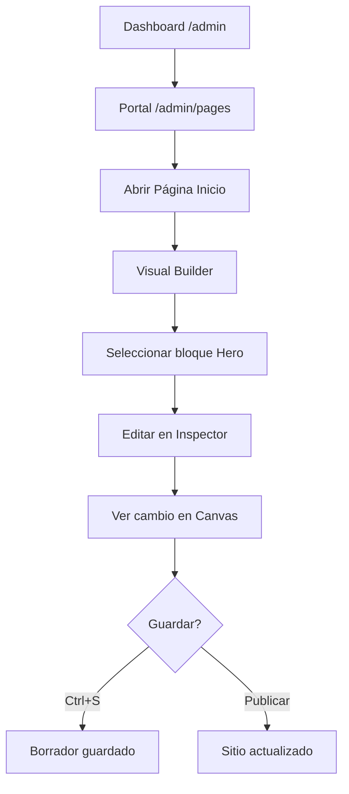
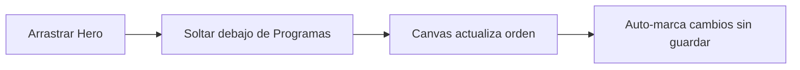
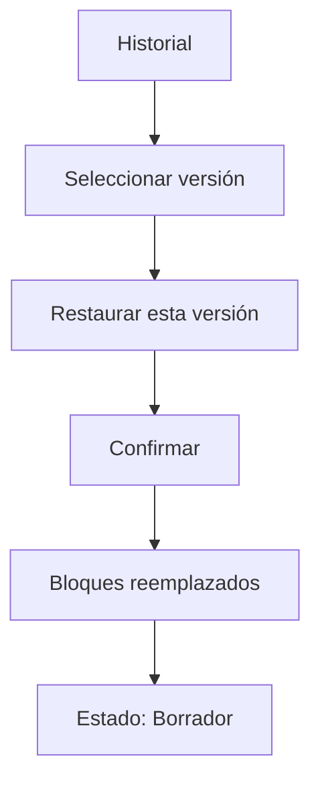

# Visual Experience Builder — Especificación UX

| Atributo | Valor |
| --- | --- |
| OT | OT-CMSV2-DESIGN-001 |
| Versión | 1.0.0 |
| Estado | Diseño aprobado para implementación |
| Audiencia | Diseño, frontend, producto |

## 1. Visión

El **Visual Experience Builder** (VEB) es el Centro Editorial Inteligente del Portal Institucional. Permite que editores sin formación técnica construyan y mantengan el sitio mediante bloques visuales, vista previa real y publicación en un clic.

**No es:** WordPress, un editor de HTML, ni un formulario con JSON.

**Es:** la experiencia editorial premium de AprendeHoy — reutilizable por cualquier institución del ecosistema.

---

## 2. Principios de diseño

| # | Principio | Implicación UX |
| --- | --- | --- |
| 1 | Sin código | Cero textarea JSON, HTML, Markdown, IDs de bloque visibles |
| 2 | Vista previa siempre | El canvas muestra el portal renderizado; el inspector es lateral |
| 3 | Todo se mueve | Drag & drop en sidebar; reordenar sin modales |
| 4 | Todo tiene historial | Panel Historial con autores y restauración |
| 5 | Publicar es simple | Un botón primario «Publicar» + estados claros |

---

## 3. Arquitectura de información

```
Centro de Administración
└── Portal
    └── Páginas del sitio          (/admin/pages)
        └── Editar: Página Inicio  (/admin/pages/home)
            └── Visual Experience Builder  (pantalla dedicada, casi fullscreen)
```

El builder **no** repite el `AdminInstitutionalHeader` completo en edición intensiva. Usa una barra propia (`BuilderToolbar`) con enlace «← Portal» y breadcrumb contextual. El header global puede colapsarse o mostrarse reducido (decisión Fase 2).

---

## 4. Wireframe — pantalla principal

```
┌──────────────────────────────────────────────────────────────────────────────┐
│ ← Portal    Inicio  >  Página Inicio              ● Publicada    [Historial ▾] │
│                                              [Guardar] [Vista previa] [Publicar]│
├──────────────┬───────────────────────────────────────────────┬─────────────────┤
│ ESTRUCTURA   │  [Escritorio] [Tablet] [Móvil]                 │ PROPIEDADES     │
│              │ ┌─────────────────────────────────────────┐   │                 │
│ ≡ Hero    ●  │ │                                         │   │ Hero            │
│ ≡ Programas  │ │     VISTA PREVIA DEL PORTAL REAL        │   │                 │
│ ≡ ¿Por qué?  │ │     (componentes institucionales)       │   │ Título          │
│ ≡ Equipo     │ │                                         │   │ [____________]  │
│ ≡ Noticias   │ │     clic en bloque → selección          │   │ Subtítulo       │
│ ≡ CTA        │ │                                         │   │ [____________]  │
│ ≡ Footer     │ │                                         │   │ Botón principal │
│              │ └─────────────────────────────────────────┘   │ Texto [____]    │
│ [+ Bloque]   │                                               │ Enlace  [____]    │
│              │                                               │ Imagen  [Elegir…] │
│              │                                               │ Video   [Elegir…] │
│              │                                               │ Overlay [○───]    │
│              │                                               │ Alineación ○ ○ ○  │
└──────────────┴───────────────────────────────────────────────┴─────────────────┘
```

### Proporciones (desktop ≥ 1280px)

| Columna | Ancho | Rol |
| --- | --- | --- |
| Izquierda (`BuilderSidebar`) | 260px fijo | Estructura y DnD |
| Centro (`BuilderCanvas`) | flex 1 | Vista previa |
| Derecha (`BuilderInspector`) | 320px fijo | Propiedades contextuales |

En **1024–1279px**: inspector como drawer derecho; canvas prioritario.

En **< 1024px**: mensaje institucional «Abre el editor en un computador para una mejor experiencia».

---

## 5. Barra superior (`BuilderToolbar`)

Siempre visible. Sticky.

| Elemento | Comportamiento |
| --- | --- |
| `← Portal` | Vuelve a `/admin/pages` (confirmar si hay cambios sin guardar) |
| `BuilderBreadcrumb` | `Portal > {título página}` — sin slug técnico |
| Badge estado | Borrador / En revisión / Programado / Publicado / Archivado |
| Guardar | `Ctrl+S` — guarda borrador sin publicar |
| Vista previa | `Ctrl+P` — abre preview en pestaña nueva o modo zen fullscreen |
| Publicar | Abre `PublishPanel` o publica directo si validación OK |
| Historial | Despliega `HistoryPanel` |

### Etiquetas institucionales de estado

| Interno (`PageStatus`) | UI |
| --- | --- |
| `draft` | Borrador |
| — (futuro workflow) | En revisión |
| `scheduled` | Programado |
| `published` | Publicada |
| `archived` | Archivada |

---

## 6. Columna izquierda — Estructura (`BuilderSidebar`)

### Lista de bloques

Cada ítem (`BuilderBlock`):

- Icono grip (`≡`) — drag handle
- Nombre editorial (desde `BlockDefinition.name`, no `type`)
- Indicador selección (borde primary)
- Badge «Oculto» si `visible: false`
- Menú `⋯`: Editar · Duplicar · Ocultar · Mover arriba/abajo · Eliminar

### Drag & drop

- Reordenar dentro de la lista
- Feedback visual: línea de inserción + sombra
- Basado en HTML5 DnD existente (`SortableBlocks`) → evolucionar a biblioteca accesible (Fase 2)

### Agregar bloque

Botón **+ Agregar bloque** abre paleta categorizada:

| Categoría | Ejemplos |
| --- | --- |
| Inicio | Hero, Presentación |
| Contenido | Programas, Noticias, Equipo |
| Conversión | CTA, Admisión, Formulario |
| Pie | Footer premium |

Bloques `html`, `markdown`: **no listados** para editores estándar.

---

## 7. Columna central — Canvas (`BuilderCanvas`)

### Reglas

1. Renderiza con los **mismos componentes** que el sitio público (`BlockPreview` → `PortalBlockSection`).
2. No es wireframe ni lista de campos.
3. Clic en un bloque en el canvas → selecciona bloque (sync con sidebar e inspector).
4. Bloque seleccionado: outline sutil `ring-2 ring-primary/40`.
5. Hover: toolbar flotante mini (Editar · Duplicar · Ocultar · Eliminar).

### `PreviewSwitcher`

| Vista | Ancho canvas |
| --- | --- |
| Escritorio | 100% (max 1440px) |
| Tablet | 768px centrado |
| Móvil | 375px centrado |

Transición animada 200ms. Estado persistido en sesión del editor.

---

## 8. Columna derecha — Inspector (`BuilderInspector`)

Solo campos del **bloque seleccionado**. Agrupados por sección semántica.

### Reglas del inspector

- Labels en español institucional
- Sin nombres de propiedad (`eyebrow`, `variant`) — usar «Antetítulo», «Estilo visual»
- Imágenes/video: botón **Elegir de la biblioteca** → modal Biblioteca Institucional
- Listas (CTAs, items): UI de filas añadir/quitar, no JSON
- Selectores técnicos (`sem_premium`) → «Estilo: Institucional / Premium»

### Hero — campos del inspector

| Campo UI | Notas |
| --- | --- |
| Antetítulo | Texto corto sobre el título |
| Título | Textarea; saltos de línea permitidos |
| Palabra destacada | Opcional; color institucional |
| Descripción | Textarea |
| Botón principal | Texto + enlace (picker de página o URL) |
| Botón secundario | Opcional |
| Imagen de fondo | Biblioteca Institucional |
| Video de fondo | Biblioteca o URL validada |
| Overlay | Slider opacidad 0–100% |
| Alineación | Izquierda / Centro / Derecha |

### Programas — campos del inspector

| Campo UI | Notas |
| --- | --- |
| Título de sección | |
| Descripción | |
| Cantidad a mostrar | Número 1–12 |
| Orden | Recientes / Destacados / Manual |
| Programas destacados | Multi-select desde contenido (si orden manual) |
| Botón «Ver todos» | Texto + enlace |

### Noticias — campos del inspector

| Campo UI | Notas |
| --- | --- |
| Modo | Últimas / Destacadas / Selección manual |
| Cantidad | |
| Título sección | |

### Equipo — campos del inspector

| Campo UI | Notas |
| --- | --- |
| Mostrar sección | Toggle |
| Cantidad | |
| Orden | Alfabético / Manual |

### CTA — campos del inspector

| Campo UI | Notas |
| --- | --- |
| Título | |
| Texto | |
| Botón | Texto + enlace |
| Imagen lateral | Biblioteca |

*(Especificación completa por bloque en Fase 3–5 por OT de bloque.)*

---

## 9. Biblioteca Institucional (selector de medios)

Al pulsar **Elegir imagen** en cualquier inspector:

```
┌─────────────────────────────────────────────┐
│ Biblioteca Institucional            [✕]   │
├─────────────────────────────────────────────┤
│ [Buscar…]  [Gráfica] [Fotos] [Editorial]    │
├─────────────────────────────────────────────┤
│  ┌────┐ ┌────┐ ┌────┐ ┌────┐               │
│  │    │ │    │ │    │ │    │  grid rich    │
│  └────┘ └────┘ └────┘ └────┘               │
├─────────────────────────────────────────────┤
│                    [Cancelar] [Usar imagen] │
└─────────────────────────────────────────────┘
```

- Reutiliza `MediaManager` en modo picker (`pickMode`)
- No `<input type="file">` en el inspector (subida solo dentro de la biblioteca)
- Carpetas: Hero, Editorial, Team, etc.

---

## 10. Historial (`HistoryPanel`)

Panel lateral o modal desde toolbar.

```
HISTORIAL

Hoy
● Hace 2 min — Marco cambió Hero
● Hace 30 min — Carolina publicó la página

Ayer
● José modificó Programas

[Restaurar esta versión]
```

- Fuente: `cms_pages.versions[]` + `identity_audit` enriquecido
- Restaurar: confirma → reemplaza bloques → guarda como borrador
- Mensajes legibles vía `formatAuditMessage` (`audit-labels.ts`)

---

## 11. Publicar (`PublishPanel`)

Flujo mínimo (MVP):

1. Clic **Publicar**
2. Resumen: «La página Inicio será visible en el sitio público»
3. Confirmar → `status: published` + toast éxito

Futuro:

- Programar fecha (`scheduled`)
- Solicitar revisión (workflow)
- Vista previa enlace público con token

---

## 12. Atajos de teclado

| Atajo | Acción |
| --- | --- |
| `Ctrl+S` / `⌘+S` | Guardar borrador |
| `Ctrl+P` / `⌘+P` | Vista previa (nueva pestaña) |
| `Ctrl+K` / `⌘+K` | Buscar bloque / página (global admin) |
| `Escape` | Deseleccionar bloque |
| `Delete` | Eliminar bloque (con confirmación) |

---

## 13. Flujos de usuario

### 13.1 Editar la Home



### 13.2 Reordenar bloques



### 13.3 Restaurar versión



---

## 14. Mapa de componentes

```
src/components/visual-builder/          (nuevo — Fase 2)
├── VisualBuilder.tsx                   # Orquestador
├── BuilderToolbar.tsx
├── BuilderBreadcrumb.tsx
├── BuilderSidebar.tsx
├── BuilderBlock.tsx
├── BuilderCanvas.tsx
├── BuilderInspector.tsx
├── PreviewSwitcher.tsx
├── HistoryPanel.tsx
├── PublishPanel.tsx
├── inspectors/                         # Un archivo por bloque
│   ├── HeroInspector.tsx
│   ├── ProgramsInspector.tsx
│   └── ...
└── index.ts

Reutiliza:
├── page-builder/BlockPreview.tsx
├── page-builder/preview-adapters.ts
├── media/MediaPicker.tsx
└── portal/* (render público)
```

### Migración desde `page-builder/`

| Archivo actual | Destino |
| --- | --- |
| `PageBuilder.tsx` | Deprecar → `VisualBuilder.tsx` |
| `SortableBlocks.tsx` | Lógica → `BuilderSidebar` |
| `BlockEditor.tsx` | Dividir → `inspectors/*` |
| `BlockToolbar.tsx` | → acciones en `BuilderBlock` |
| `PreviewDevice.tsx` | → `PreviewSwitcher` |
| `PageEditorClient.tsx` | Shell + `VisualBuilder` |

---

## 15. Gap analysis — estado actual vs objetivo

| Capacidad | Hoy (`PageBuilder`) | Objetivo (VEB) | Gap |
| --- | --- | --- | --- |
| Layout 3 columnas | Parcial (preview solo xl) | Canvas central siempre | **Alto** |
| Vista previa real | Sí (`BlockPreview`) | Centro protagonista | Reubicar |
| Drag & drop | Sí (sidebar) | Sí + feedback mejor | **Medio** |
| Inspector sin JSON | No (~15 textareas JSON) | Solo campos visuales | **Alto** |
| Biblioteca medios | Parcial (`MediaField`) | Modal institucional siempre | **Medio** |
| Historial UI | No | `HistoryPanel` | **Alto** |
| Estados editoriales | Muestra `slug`, `status` raw | Etiquetas institucionales | **Medio** |
| Shell admin unificado | Editor con header propio | `BuilderToolbar` + breadcrumb | **Medio** |
| Responsive preview | Sí (modo separado) | Switcher integrado en canvas | **Bajo** |
| Atajos teclado | No | Ctrl+S, Ctrl+P, Ctrl+K | **Medio** |
| Clic bloque en canvas | No | Selección sync | **Alto** |
| Bloques html/markdown | En biblioteca | Ocultos a editores | **Bajo** |

### Deuda técnica crítica en `BlockEditor.tsx`

Campos `JSON.stringify` a reemplazar por editores visuales:

- `highlights`, `features`, `profiles`, `items`, `buttons`, `stats`, `channels`, `actions` (múltiples bloques)
- Casos `html` / `markdown` — mantener solo para superadmin vía flag

---

## 16. Home institucional — bloques objetivo (Fase 6)

Orden narrativo `portal-001` (referencia `home-portal-001.ts`):

1. Hero (premium)
2. Presentación / ¿Por qué estudiar?
3. Perfiles de postulante (`audience_profiles`)
4. Programas / Oferta académica
5. Modalidad
6. Equipo / Autoridades
7. Noticias
8. CTA admisión
9. Footer premium

Cada uno con inspector dedicado; ninguno con JSON visible.

---

## 17. Consistencia con CMS UX Guidelines

- Breadcrumb: `Inicio > Portal > Página Inicio` (en toolbar del builder)
- Sin términos: Page Builder, block type, tenant, settings, variant
- Empty states con acción («Agrega tu primer bloque»)
- Errores de validación al publicar en lenguaje claro
- Colores y tipografía: tokens SEM / Experience Kit

---

## 18. Criterios de aceptación (implementación)

Referencia completa en [OT-CMSV2-DESIGN-001](../ot/OT-CMSV2-DESIGN-001.md).

Checklist rápido para QA del builder:

- [ ] Editor reordena bloques con DnD sin recargar página
- [ ] Canvas muestra portal idéntico al público
- [ ] Inspector Hero completo sin JSON
- [ ] Imagen abre Biblioteca Institucional
- [ ] Guardar borrador y Publicar funcionan
- [ ] Historial lista versiones y restaura
- [ ] Escritorio / Tablet / Móvil conmutables en < 1s
- [ ] Ningún campo muestra IDs internos de bloque
- [ ] Ctrl+S guarda; feedback «Guardado» visible

---

## 19. Referencias

- [OT-CMSV2-DESIGN-001](../ot/OT-CMSV2-DESIGN-001.md)
- [OT-CMSV2-001A](../ot/OT-CMSV2-001A.md) — Shell unificado
- [CMS-UX-GUIDELINES.md](./CMS-UX-GUIDELINES.md)
- [PAGE-BUILDER.md](../cms/PAGE-BUILDER.md)
- [EDITORIAL-ART-DIRECTION.md](./EDITORIAL-ART-DIRECTION.md)
- Código actual: `src/components/page-builder/`
