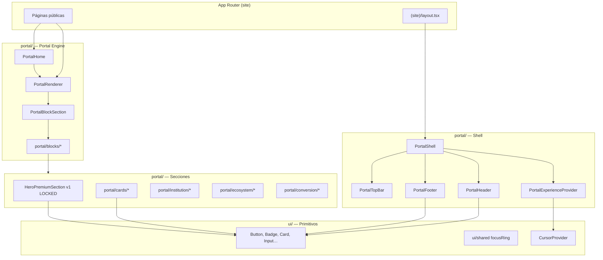
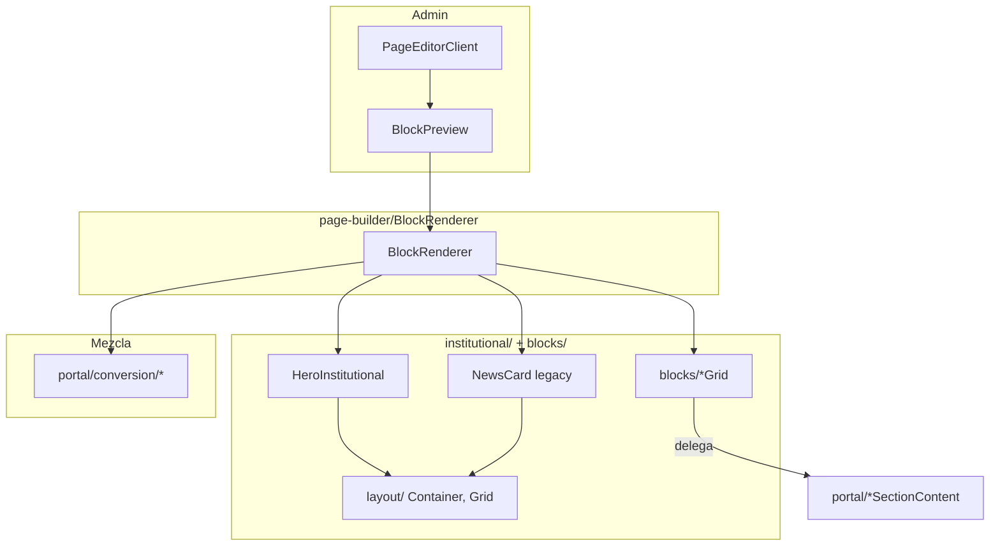
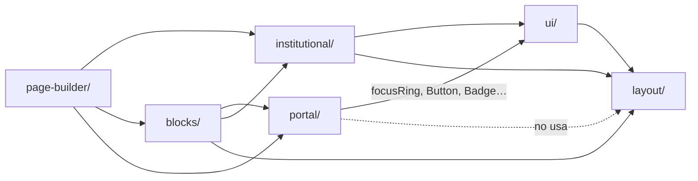

# UI-INVENTORY — Auditoría e Inventario del Core UI

| Atributo | Valor |
| --- | --- |
| OT | OT-CORE-UI-001 |
| Épica | EP-CORE-001 — Consolidación Core UI |
| Versión | 1.0.0 |
| Estado | Completada |
| Fecha | 2026-06-30 |
| Alcance | `src/components/` (252 archivos `.ts`/`.tsx`) |
| Sucesor | [CORE-UI-CANON.md](./CORE-UI-CANON.md) — canon oficial v1.0 (OT-CORE-UI-002) |

---

## 1. Resumen ejecutivo

El frontend opera con **tres capas visuales paralelas** que compiten por el rol de Core UI:

| Capa | Archivos | Rol actual |
| --- | ---: | --- |
| `portal/` | 95 | **Producción pública** — Portal Engine, shell, cards, bloques CMS |
| `ui/` + `layout/` | 40 | **Primitivos documentados** — adoptados parcialmente |
| `institutional/` + `blocks/` | 33 | **Legacy / puente** — page-builder preview y grids heredados |

**Ruta pública activa:** `(site)/layout.tsx` → `PortalShell` → `PortalRenderer` → `PortalBlockSection`.

**Ruta legacy activa (solo admin/preview):** `page-builder/BlockRenderer` → mezcla `institutional/`, `blocks/` y `portal/conversion/`.

**Hallazgos críticos:**

1. Duplicación estructural Header / Footer / Hero / Cards entre `portal/`, `institutional/` y `ui/`.
2. `layout/` (Container, Grid, Section) no es usado por `portal/`; existe un sistema paralelo (`PortalContainer`, `PortalSection`).
3. Componentes huérfanos: `InstitutionSection`, `AcademicEcosystemSection`, `HeroCarousel`, `HomeInstitutional`, `navigation/SiteShell`.
4. `blocks/*Grid` ya delegan a `portal/` — capa de compatibilidad, no implementación propia.
5. `ui/hero`, `ui/navbar`, `ui/footer`, `ui/cta` solo se consumen en el showcase admin; cero uso en rutas públicas.

---

## 2. Clasificación

### Leyenda

| Estado | Significado |
| --- | --- |
| **Canonical** | Componente oficial del Core UI en producción o primitivo adoptado |
| **Deprecated** | Superseded; aún referenciado por preview/legacy |
| **Experimental** | Showcase, prototipo o sin consumidores en producción |
| **Internal** | Admin, CMS, identidad, media — fuera del Core UI público |

### 2.1 Por dominio

| Dominio | Archivos | Clasificación dominio | Notas |
| --- | ---: | --- | --- |
| `portal/` | 95 | **Canonical** (público) | Motor visual de producción |
| `ui/` | 33 | **Canonical** (primitivos) | Base reutilizable; adopción parcial en portal |
| `layout/` | 7 | **Canonical** (target) | No adoptado por portal; usado por legacy |
| `institutional/` | 16 | **Deprecated** | Reemplazado por `portal/` |
| `blocks/` | 17 | **Deprecated** (puente) | Wrappers → `portal/`; hero/stats aún legacy |
| `page-builder/` | 16 | **Internal** | Editor CMS; usa pipeline legacy en preview |
| `config/` | 18 | **Internal** | Panel de configuración institucional |
| `media/` | 24 | **Internal** | Biblioteca de medios admin |
| `menu/` | 13 | **Internal** | Editor de menús CMS |
| `content/` | 3 | **Internal** | Content Engine admin |
| `identity/` | 3 | **Internal** | Login, logout, equipo admin |
| `events/` | 1 | **Internal** | Admin eventos |
| `workflow/` | 1 | **Internal** | Admin workflows |
| `navigation/` | 4 | **Deprecated** | Shell anterior; sin rutas activas |
| `design-system/` | 1 | **Gobernanza** | Catálogo visual `/internal/design-system` |

---

## 3. Mapa de componentes

### 3.1 Flujo público (Canonical)



### 3.2 Flujo legacy (Deprecated — admin preview)



### 3.3 Dependencias entre capas



---

## 4. Tabla de componentes canónicos

Componentes que deben constituir el **Core UI v1.0** según uso en producción y alineación con DOC-000.

### 4.1 Shell y layout (`portal/layout/`)

| Componente | Archivo | Versión | Consumidores | Notas |
| --- | --- | --- | --- | --- |
| PortalShell | `portal/PortalShell.tsx` | — | `(site)/layout` | Entry point público |
| PortalHeader | `portal/layout/PortalHeader.tsx` | candidato v1.0 | PortalShell | CMS menus + branding |
| PortalTopBar | `portal/layout/PortalTopBar.tsx` | candidato v1.0 | PortalShell | Barra superior configurable |
| PortalFooter | `portal/layout/PortalFooter.tsx` | v1.0 (OT-007) | PortalShell | 7 subcomponentes footer |
| PortalMobileNav | `portal/layout/PortalMobileNav.tsx` | — | PortalHeader | Drawer móvil |
| PortalContainer | `portal/layout/PortalContainer.tsx` | — | Todo portal | Paralelo a `layout/Container` |
| PortalSection | `portal/layout/PortalContainer.tsx` | — | Todo portal | Paralelo a `layout/Section` |
| PortalBreadcrumb | `portal/layout/PortalBreadcrumb.tsx` | — | Páginas detalle/listado | Paralelo a `ui/breadcrumb` |
| PortalCTA | `portal/layout/PortalCTA.tsx` | — | CtaBlock, admisión | Usa `ui/button` |
| PortalBrandMark | `portal/PortalBrandMark.tsx` | — | Header, Footer | Logo institucional |

**Footer subcomponentes (Canonical):** `FooterInstitution`, `FooterPrograms`, `FooterContact`, `FooterBottom`, `FooterSocial`, `FooterLinkColumn`, `FooterSectionHeading`, `BackToTop`.

### 4.2 Hero (`portal/sections/`)

| Componente | Archivo | Versión | Estado DOC |
| --- | --- | --- | --- |
| HeroPremiumSection | `sections/HeroPremiumSection.tsx` | **v1.0 LOCKED** | CORE-HERO-v1.md |
| HeroPremiumImage | `sections/HeroPremiumImage.tsx` | v1.0 | Subcomponente LOCKED |
| HeroPremiumInteractiveShell | `sections/HeroPremiumInteractiveShell.tsx` | v1.0 | Subcomponente LOCKED |
| HeroPortalSection | `sections/HeroPortalSection.tsx` | — | Resolver server → Premium |
| HeroBlockSection | `portal/blocks/HeroBlockSection.tsx` | — | Entry CMS block |

### 4.3 Cards (`portal/cards/`)

| Componente | Rol | Primitivo base |
| --- | --- | --- |
| PortalCard | Wrapper unificado `.institutional-card` | — |
| CardMedia | Imagen optimizada `next/image` | — |
| ProgramCard | Programas académicos | Badge, focusRing |
| NewsCard | Noticias | Badge, focusRing |
| EventCard | Eventos | focusRing |
| AcademicAgendaCard | Agenda académica | focusRing |
| InstitutionalNoticeCard | Avisos | focusRing |
| LibraryCard / ResourceCard | Biblioteca / recursos | Badge, BlockIcon |
| TeamCard | Equipo docente | Avatar |
| FeatureCard | Features institucionales | — |
| StatCard | Estadísticas | — |
| TestimonialCard | Testimonios | — |
| CardSkeleton / CardGridSkeleton | Loading states | — |
| ProgramCardMedia | Media programa | Internal al card |

### 4.4 Bloques CMS (`portal/blocks/`)

| BlockSection | Delega a |
| --- | --- |
| HeroBlockSection | HeroPortalSection / HeroPremiumSection / PortalHero* |
| PresentationBlockSection | institution/InstitutionSectionContent |
| ModalityBlockSection | institution/InstitutionSectionContent |
| GalleryBlockSection | institution/InstitutionSectionContent |
| StatsBlockSection | institution/InstitutionSectionContent |
| TestimonialsBlockSection | institution/InstitutionSectionContent |
| VerseBlockSection | institution/InstitutionSectionContent |
| NewsBlockSection | ecosystem/EcosystemSectionContent |
| EventsBlockSection | ecosystem/EcosystemSectionContent |
| LibraryBlockSection | ecosystem/EcosystemSectionContent |
| ResourcesBlockSection | ecosystem/EcosystemSectionContent |
| AcademicAgendaBlockSection | ecosystem/AcademicAgendaSectionContent |
| InstitutionalNoticesBlockSection | ecosystem/InstitutionalNoticesSectionContent |
| ProgramsBlockSection* | ProgramsSection → ProgramsSectionContent |
| TeachersBlockSection* | TeachersSection → TeachersSectionContent |
| AdmissionProcessBlockSection | conversion/AdmissionProcessSection |
| ScholarshipsBlockSection | conversion/ScholarshipsSection |
| FaqBlockSection | conversion/FaqSection |
| QuickContactBlockSection | conversion/QuickContactSection |
| AllianceBlockSection | conversion/AllianceSection |
| CtaBlockSection | PortalCTA |
| GenericContentBlockSection | `blocks/TextSection`, ContactForm, etc. |

\*Vía `PortalBlockSection` → `ProgramsSection` / `TeachersSection`.

### 4.5 Orquestación portal

| Componente | Rol |
| --- | --- |
| PortalRenderer | Motor de renderizado por bloques (producción) |
| PortalBlockSection | Switch de tipos de bloque |
| PortalHome | Home → PortalRenderer |
| PortalCmsPage | Páginas CMS genéricas |
| PortalSectionHeader / PortalPageHeader | Encabezados de sección |
| PortalEmptyState | Estados vacíos |
| PortalBlockSkeleton | Suspense fallbacks |
| ShareBar | Compartir en detalle |
| PortalStructuredData | SEO JSON-LD |
| PortalExperienceProvider | Cursor premium (opcional) |
| BlockIcon | Iconografía de bloques |

### 4.6 Primitivos UI (`ui/`)

| Componente | Adopción | Clasificación |
| --- | --- | --- |
| button | Alta (portal, admin, media) | **Canonical** |
| card | Alta (admin, config) | **Canonical** |
| input, textarea, label, select | Alta (admin) | **Canonical** |
| switch, checkbox, radio | Media (config, CMS) | **Canonical** |
| badge | Media (cards portal, páginas) | **Canonical** |
| modal, alert | Media (media picker) | **Canonical** |
| accordion | Baja (FaqSection) | **Canonical** |
| avatar | Baja (TeamCard) | **Canonical** |
| shared (focusRing) | Alta (portal shell, cards) | **Canonical** |
| CursorProvider | PortalExperienceProvider | **Canonical** |
| hero | Solo showcase | **Experimental** |
| navbar | Solo showcase | **Experimental** |
| footer | Solo showcase | **Experimental** |
| cta | Solo showcase | **Experimental** |
| breadcrumb | Solo showcase | **Experimental** |
| pagination | Solo showcase | **Experimental** |
| drawer, dropdown, tooltip, spinner, skeleton, tabs | Admin/showcase | **Canonical** (admin) / **Experimental** (público) |
| PremiumCursor, CursorTrail, CursorMagnet | Hook interno | **Internal** |

### 4.7 Layout primitivos (`layout/`)

| Componente | Adopción producción | Clasificación |
| --- | --- | --- |
| Container | institutional/, blocks/, ui/ | **Canonical** (target) — no portal |
| Section | idem | **Canonical** (target) |
| Grid | blocks/, institutional/ | **Canonical** (target) |
| Stack | blocks/, institutional/ | **Canonical** (target) |
| Page | Sin consumidores detectados | **Experimental** |
| Spacer | Solo showcase | **Experimental** |

---

## 5. Lista de componentes legacy (Deprecated)

### 5.1 Carpeta `institutional/` (16 archivos)

| Componente | Reemplazo canónico | Referenciado por |
| --- | --- | --- |
| HeroInstitutional | HeroPremiumSection | BlockRenderer (preview hero) |
| NavbarPremium | PortalHeader | SiteShell, showcase |
| InstitutionalFooter | PortalFooter | SiteShell, showcase |
| HomeInstitutional | PortalHome + PortalRenderer | Solo export; sin ruta |
| ProgramCard | portal/cards/ProgramCard | BlockRenderer vía TeachersGrid* |
| NewsCard | portal/cards/NewsCard | — (grids delegan a portal) |
| EventCard | portal/cards/EventCard | — |
| TeacherCard | portal/cards/TeamCard | TeachersGrid (wrapper legacy) |
| TestimonialCard | portal/cards/TestimonialCard | TestimonialsGrid |
| InstitutionalCard | portal/cards/PortalCard | Base de cards legacy |
| SectionTitle | PortalSectionHeader | blocks/*, institutional/* |
| CTASection | PortalCTA / CtaBlockSection | BlockRenderer |
| StatsInstitution | portal/cards/StatCard + StatsSectionContent | BlockRenderer (stats) |
| VerseBlock | VerseSectionContent | BlockRenderer, InstitutionPresentation |
| InstitutionalGallery | GallerySectionContent | HomeInstitutional |

### 5.2 Carpeta `blocks/` (17 archivos)

| Componente | Estado real | Notas |
| --- | --- | --- |
| ProgramsGrid | Puente → ProgramsSectionContent | Deprecated como capa |
| NewsGrid | Puente → NewsSectionContent | idem |
| EventsGrid | Puente → EventsSectionContent | idem |
| LibraryGrid | Puente → LibrarySectionContent | idem |
| ResourcesGrid | Puente → ResourcesSectionContent | idem |
| TeachersGrid | Mezcla institutional + layout | Deprecated |
| TestimonialsGrid | Puente → TestimonialsSectionContent | idem |
| GalleryGrid | Puente → GallerySectionContent | idem |
| ModalitySection | Puente → ModalitySectionContent | idem |
| InstitutionPresentation | institutional/SectionTitle + VerseBlock | Deprecated |
| TextSection, VideoSection, ContactForm | Usados por GenericContentBlockSection | Migrar a portal |
| HtmlBlock, MarkdownBlock, Divider | GenericContentBlockSection + BlockRenderer | Migrar a portal |
| Testimonials | institutional cards | Deprecated |

### 5.3 Carpeta `navigation/` (4 archivos)

| Componente | Estado |
| --- | --- |
| SiteShell | **Huérfano** — 0 imports fuera de su archivo |
| SiteHeader | Solo usado por SiteShell |
| SiteFooter | Solo usado por SiteShell |
| NavMenu | SiteHeader, SiteFooter |

### 5.4 Componentes portal huérfanos / superseded

| Componente | Estado | Notas |
| --- | --- | --- |
| PortalHero | Deprecated | Fallback en HeroBlockSection (modo legacy) |
| PortalHeroMedia | Parcial | Usado por PortalHero + InstitutionSectionContent |
| PortalHeroBenefits | Deprecated | Solo con PortalHero |
| HeroCarousel | **Huérfano** | 0 imports; lógica absorbida por HeroPremiumSection |
| InstitutionSection | **Huérfano** | Reemplazado por bloques individuales en PortalRenderer |
| AcademicEcosystemSection | **Huérfano** | idem |
| HomeInstitutional | **Huérfano** | Sin ruta activa |

---

## 6. Lista de componentes duplicados

### 6.1 Matriz de duplicidad visual

| Concepto | Canonical (producción) | Legacy | Showcase UI | Unificación OT-002 |
| --- | --- | --- | --- | --- |
| **Header / Nav** | PortalHeader | NavbarPremium | ui/navbar | Alta prioridad |
| **Footer** | PortalFooter (+ 8 subs) | InstitutionalFooter | ui/footer | Alta prioridad |
| **Hero** | HeroPremiumSection v1 | HeroInstitutional, PortalHero | ui/hero | Hero LOCKED; archivar resto |
| **Container** | PortalContainer | layout/Container | — | OT-CORE-UI-006 |
| **Section** | PortalSection | layout/Section | — | OT-CORE-UI-006 |
| **Grid** | CSS en globals.css | layout/Grid | — | OT-CORE-UI-006 |
| **Breadcrumb** | PortalBreadcrumb | — | ui/breadcrumb | Media |
| **CTA** | PortalCTA | CTASection | ui/cta | Media |
| **Section title** | PortalSectionHeader | SectionTitle | — | Baja (ya delegado) |
| **Card base** | PortalCard | InstitutionalCard | ui/card | ui/card es admin; PortalCard es público |
| **ProgramCard** | portal/ProgramCard | institutional/ProgramCard | — | Alta |
| **NewsCard** | portal/NewsCard | institutional/NewsCard | — | Alta |
| **EventCard** | portal/EventCard | institutional/EventCard | — | Alta |
| **TeamCard** | portal/TeamCard | institutional/TeacherCard | — | Alta |
| **TestimonialCard** | portal/TestimonialCard | institutional/TestimonialCard | — | Alta |
| **Stats** | StatCard + StatsSectionContent | StatsInstitution | — | Alta |
| **Verse** | VerseSectionContent | VerseBlock | — | Media |
| **Gallery** | GallerySectionContent | InstitutionalGallery | — | Media |

### 6.2 Pipelines de renderizado duplicados

| Pipeline | Entry | Usado en | Estado |
| --- | --- | --- | --- |
| **Portal Engine** | PortalRenderer | Home, `[slug]`, CMS pages | **Canonical** |
| **Block Renderer** | BlockRenderer | Page builder preview | **Deprecated** |
| **Home estático** | HomeInstitutional | Ninguna ruta | **Deprecated** |
| **Site Shell** | SiteShell | Ninguna ruta | **Deprecated** |

---

## 7. Candidatos a unificación

Priorizados para **OT-CORE-UI-002 — Componentes Canónicos**:

| # | Acción | Origen | Destino | Riesgo |
| ---: | --- | --- | --- | --- |
| 1 | Declarar canónico y congelar | `portal/layout/*` | Core UI Shell v1.0 | Bajo |
| 2 | Archivar (no eliminar aún) | `institutional/*` | — | Bajo |
| 3 | Migrar preview | `BlockRenderer` hero case | HeroPremiumSection | Medio |
| 4 | Eliminar capa puente | `blocks/*Grid` | Llamar portal blocks directo | Medio |
| 5 | Fusionar layout | `PortalContainer` ↔ `layout/Container` | Un solo API | Alto |
| 6 | Retirar huérfanos | HeroCarousel, InstitutionSection, AcademicEcosystemSection, SiteShell | — | Bajo |
| 7 | Decidir ui/hero, navbar, footer | `ui/*` compuestos | Absorber en portal o eliminar | Medio |
| 8 | Unificar stats preview | StatsInstitution | StatsSectionContent | Bajo |

---

## 8. Árbol definitivo propuesto — Core UI v1.0

Estructura objetivo tras EP-CORE-001. Los dominios **Internal** se mantienen fuera del Core UI público.

```
src/components/
│
├── ui/                          # CANONICAL — Primitivos atómicos
│   ├── button, input, card, badge, modal…
│   ├── shared.ts                # focusRing, utilidades
│   └── CursorProvider           # Efecto opcional tenant
│
├── layout/                      # CANONICAL — Layout system (fusión OT-006)
│   ├── Container                # ← absorbe PortalContainer
│   ├── Section                  # ← absorbe PortalSection
│   ├── Grid, Stack, Page
│   └── index.ts
│
├── portal/                      # CANONICAL — Composición pública CMS-driven
│   ├── PortalShell.tsx
│   ├── PortalRenderer.tsx
│   ├── PortalBlockSection.tsx
│   │
│   ├── layout/                  # Shell LOCKED v1.0
│   │   ├── PortalHeader
│   │   ├── PortalFooter (+ footer/*)
│   │   ├── PortalTopBar
│   │   ├── PortalMobileNav
│   │   ├── PortalBreadcrumb
│   │   └── PortalCTA
│   │
│   ├── sections/                # Hero LOCKED v1.0
│   │   └── HeroPremium*
│   │
│   ├── cards/                   # Cards LOCKED v1.0
│   │   ├── PortalCard (base)
│   │   └── *Card (dominio)
│   │
│   ├── blocks/                  # CMS block adapters (thin)
│   ├── institution/             # Contenido institucional
│   ├── ecosystem/               # Noticias, eventos, biblioteca
│   └── conversion/              # Admisión, FAQ, contacto
│
├── config/                      # INTERNAL — Admin configuración
├── content/                     # INTERNAL — Content Engine
├── media/                       # INTERNAL — Media Library
├── menu/                        # INTERNAL — Menús CMS
├── page-builder/                # INTERNAL — Editor (preview → portal)
├── identity/                    # INTERNAL — Auth admin
├── events/                      # INTERNAL
├── workflow/                    # INTERNAL
│
├── blocks/          [DEPRECATED] # Eliminar en OT-002/003 tras migrar preview
├── institutional/   [DEPRECATED] # Archivar tras migrar BlockRenderer
├── navigation/      [DEPRECATED] # Eliminar (huérfano)
└── design-system/   [EXPERIMENTAL] # Mantener como catálogo QA
```

---

## 9. Inventario completo por carpeta

### 9.1 `portal/` (95) — Canonical

<details>
<summary>Lista de archivos</summary>

**Raíz:** AcademicEcosystemSection, AcademicEcosystemSectionSkeleton, BlockIcon, InstitutionSection, InstitutionSectionSkeleton, PortalBlockSection, PortalBlockSkeleton, PortalBrandMark, PortalCmsPage, PortalEmptyState, PortalExperienceProvider, PortalHero, PortalHeroBenefits, PortalHeroMedia, PortalHome, PortalRenderer, PortalSectionHeader, PortalShell, ProgramsPageContent, ProgramsSection, ProgramsSectionContent, ProgramsSectionSkeleton, ShareBar, TeachersSection, TeachersSectionContent.

**blocks/ (22):** AcademicAgendaBlockSection, AdmissionProcessBlockSection, AllianceBlockSection, CtaBlockSection, EventsBlockSection, FaqBlockSection, GalleryBlockSection, GenericContentBlockSection, HeroBlockSection, InstitutionalNoticesBlockSection, LibraryBlockSection, ModalityBlockSection, NewsBlockSection, PresentationBlockSection, QuickContactBlockSection, ResourcesBlockSection, ScholarshipsBlockSection, StatsBlockSection, TestimonialsBlockSection, VerseBlockSection, (+ blocks referenciados vía Programs/Teachers).

**cards/ (15):** AcademicAgendaCard, CardMedia, CardSkeleton, EventCard, FeatureCard, InstitutionalNoticeCard, LibraryCard, NewsCard, PortalCard, ProgramCard, ProgramCardMedia, StatCard, TeamCard, TestimonialCard, index.ts.

**conversion/ (5):** AdmissionProcessSection, AllianceSection, FaqSection, QuickContactSection, ScholarshipsSection.

**ecosystem/ (3):** AcademicAgendaSectionContent, EcosystemSectionContent, InstitutionalNoticesSectionContent.

**institution/ (3):** GalleryImage, InstitutionSectionContent, TestimonialAvatar.

**layout/ (16):** PortalBreadcrumb, PortalContainer, PortalCTA, PortalFooter, PortalHeader, PortalMobileNav, PortalTopBar, footer/* (9), index.ts.

**sections/ (5):** HeroCarousel*, HeroPortalSection, HeroPremiumImage, HeroPremiumInteractiveShell, HeroPremiumSection.

**seo/ (1):** PortalStructuredData.

\*HeroCarousel = huérfano.

</details>

### 9.2 `ui/` (33) — Canonical primitivos

accordion, alert, avatar, badge, breadcrumb, button, card, checkbox, cta*, cursor*, drawer, dropdown, footer*, hero*, icon, input, label, modal, navbar*, pagination, PremiumCursor, radio, select, shared, skeleton, spinner, switch, tabs, textarea, tooltip, index.ts.

\*Compuestos experimentales o cursor interno.

### 9.3 `layout/` (7) — Canonical target

container, grid, page, section, spacer, stack, index.ts.

### 9.4 `institutional/` (16) — Deprecated

CTASection, EventCard, HeroInstitutional, HomeInstitutional*, InstitutionalCard, InstitutionalFooter, InstitutionalGallery, NavbarPremium, NewsCard, ProgramCard, SectionTitle, StatsInstitution, TeacherCard, TestimonialCard, VerseBlock, index.ts.

### 9.5 `blocks/` (17) — Deprecated puente

ContactForm, Divider, EventsGrid, GalleryGrid, HtmlBlock, InstitutionPresentation, LibraryGrid, MarkdownBlock, ModalitySection, NewsGrid, ProgramsGrid, ResourcesGrid, TeachersGrid, Testimonials, TestimonialsGrid, TextSection, VideoSection.

### 9.6 Dominios Internal

| Dominio | Componentes |
| --- | --- |
| **config/** (18) | BrandingPanel, ColorPicker, ConfigurationHub, ConfigurationLayout, ContactForm, FeatureTogglePanel, HeroPortalPanel, HeroPortalPreview, HeroSlideEditor, HeroSlideList, ImageUploader, InstitutionForm, PortalCopyForm, PortalCursorForm, PortalStatusCard, PortalTopBarForm, SeoEditor, SocialLinksForm |
| **media/** (24) | MediaLibraryClient, MediaManager, MediaPicker, MediaGrid, MediaCard, MediaDetails, MediaDropzone, MediaFilters, MediaToolbar, MediaSearch, MediaBulkBar, MediaEmptyState, MediaHeroEmptyState, MediaBreadcrumb, MediaContextBanner, MediaFolderTree, MediaListTable, MediaOptimizationInfo, MediaPreview, MediaQuickFilters, MediaTagsEditor, MediaUsage, MediaUsageList, index.ts |
| **menu/** (13) | MenuEditorClient, MenuListClient, MenuItemEditor, MenuTree, MenuSortableList, MenuPreview, MenuBadge, IconSelector, MenuLocationSelector, MenuTargetSelector, MenuTypeSelector, MenuVisibilitySwitch, menu-icons |
| **page-builder/** (16) | PageBuilder, PageEditorClient, PageListClient, BlockEditor, BlockRenderer, ServerBlockRenderer, BlockPreview, BlockPalette, BlockToolbar, BlockDataSourceEditor, PageSettings, PreviewDevice, SortableBlocks, TemplateSelector, useResolvedBlocks, index.ts |
| **content/** (3) | ContentHubClient, ContentListClient, ContentEditorClient |
| **identity/** (3) | LoginForm, LogoutButton, TeamSettingsClient |
| **events/** (1) | EventsAdminClient |
| **workflow/** (1) | WorkflowAdminClient |
| **navigation/** (4) | SiteShell*, SiteHeader, SiteFooter, NavMenu |
| **design-system/** (1) | DesignSystemShowcase |

---

## 10. Rutas → componentes (mapa de consumo público)

| Ruta | Componentes principales |
| --- | --- |
| `(site)/layout` | PortalShell |
| `(site)/` | PortalHome → PortalRenderer |
| `(site)/[slug]` | PortalRenderer |
| `(site)/programas` | ProgramsPageContent |
| `(site)/noticias`, `/eventos`, `/equipo`, `/avisos`, `/agenda-academica` | portal/layout + cards |
| `(site)/admision` | PortalContainer, PortalCTA |
| `(site)/institucion`, `/contacto` | PortalCmsPage |
| `admin/design-system` | DesignSystemShowcase (institutional + ui + layout) |
| `admin/pages/[id]` | PageEditorClient → BlockRenderer (legacy preview) |
| `admin/config` | ConfigurationHub → HeroPortalPreview (HeroPremiumSection) |

---

## 11. Métricas

| Métrica | Valor |
| --- | ---: |
| Total archivos `src/components` | 252 |
| Archivos Canonical (portal + ui + layout) | 135 (54%) |
| Archivos Deprecated (institutional + blocks + navigation) | 37 (15%) |
| Archivos Internal (admin/CMS) | 78 (31%) |
| Archivos Experimental | 2 (design-system + ui compuestos) |
| Duplicidades de concepto identificadas | 18 pares |
| Componentes huérfanos (0 consumo producción) | 6 |
| Pipelines de renderizado | 2 activos (portal + preview) |

---

## 12. Recomendaciones para siguientes OT

### OT-CORE-UI-002 — Componentes Canónicos ✅

Ver [CORE-UI-CANON.md](./CORE-UI-CANON.md).

### OT-CORE-UI-003 — Design Tokens ✅

- Tokens en `src/design/tokens/` + `src/styles/design-tokens.css`
- Ver [DOC-002-DESIGN-TOKENS.md](./DOC-002-DESIGN-TOKENS.md)

### OT-CORE-UI-004 — Breakpoints Oficiales

1. Documentar excepciones Hero (767, 1200, 1600) vs DOC-000.
2. Alinear `src/design/breakpoints.ts` con DOC-001.

### OT-CORE-UI-005 — Branding Multi-tenant

1. Verificar inyección en `app/layout.tsx` y consumo real en CSS.

### OT-CORE-UI-006 — Layout System

1. Decisión: fusionar `PortalContainer`/`PortalSection` en `layout/` o viceversa.
2. Migrar `portal/` a un solo grid system.

### OT-CORE-UI-007 — Responsive Certification

1. Checklist Header, Hero, Footer, Cards en breakpoints DOC-000.
2. Corregir gap nav 1024–1280px (UX-AUDIT-001).

### OT-CORE-UI-008 — Documentación DOC-000 → DOC-012

1. Commitear constitución y stubs de estándares hijos.

### OT-CORE-UI-009 — UI Freeze v1.0

1. LOCK Header v1.0, Footer v1.0 (Hero ya LOCKED).
2. Certificar Cards base antes de nuevas páginas.

---

## 13. Criterios de aceptación OT-CORE-UI-001

| Criterio | Estado |
| --- | --- |
| Inventario completo generado | ✅ 252 archivos catalogados |
| Componentes clasificados | ✅ Canonical / Deprecated / Experimental / Internal |
| Duplicidades identificadas | ✅ 18 pares + 2 pipelines |
| Mapa de dependencias | ✅ Secciones 3 y 10 |
| Base para consolidación | ✅ Árbol §8 + recomendaciones §12 |
| Sin cambios de código | ✅ Solo documentación |

---

## Referencias

- **[CORE-UI-CANON.md](../frontend/CORE-UI-CANON.md)** — Canon oficial Core UI v1.0 (OT-CORE-UI-002)
- DOC-000 — Frontend Constitution v1.0 (pendiente en repo)
- [CORE-HERO-v1.md](../core/CORE-HERO-v1.md) — Hero LOCKED
- [DESIGN-SYSTEM.md](../design/DESIGN-SYSTEM.md) — Design System SEM v1.1
- [UX-AUDIT-001.md](../audits/UX-AUDIT-001.md) — Gaps UX/UI
- [PORTAL-ENGINE.md](../core/PORTAL-ENGINE.md) — Portal Engine
- [OT-CORE-UI-001.md](../ot/OT-CORE-UI-001.md) — Registro de esta OT
